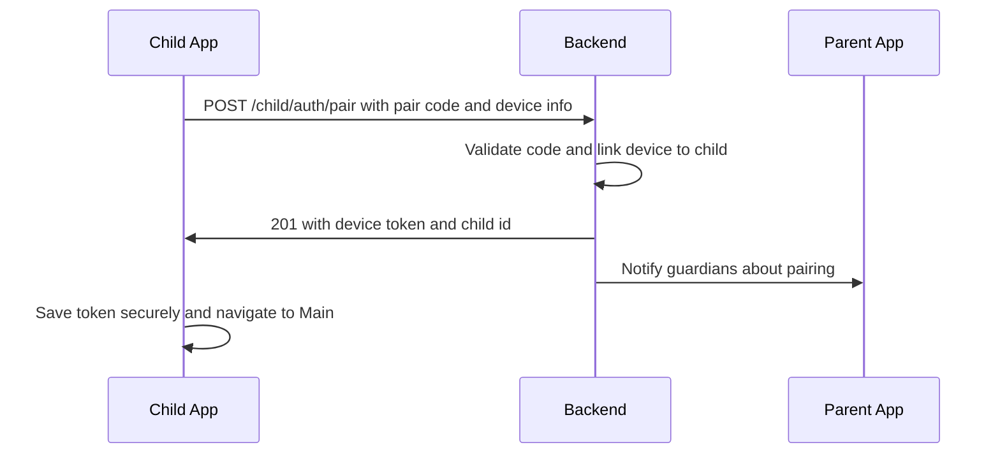

## Feature 01 — Device Pairing (Child App)

### Overview
Bind the child device to a family using a short code or QR from the parent app. Securely provision a device token for subsequent authenticated calls.

### User Stories
- As a child/guardian, I can enter or scan a pairing code to connect this device to the family.
- As a system, I securely issue a device token bound to deviceId.

### UI/UX
- Screen: `PairingScreen.tsx`
  - Inputs: `pairCode` text field; QR scan option
  - States: idle -> verifying -> success -> routed to `MainScreen`
  - Errors: invalid/expired code; network; already paired

### Frontend Mapping
- Components: `PairingScreen`, `FloatingNotification`, `dialog`
- State: `device: { deviceId, childId, deviceToken, status }`
- Storage: Secure storage for `deviceToken`; local `deviceId`

### Data Model (client)
- `DeviceRegistration`: `{ pairCode: string, deviceInfo: { deviceId, platform, osVersion, appVersion, fcmToken? } }`
- `DeviceAuth`: `{ deviceToken: string, childId: string }`

### API Contracts
- POST `/api/v1/child/auth/pair`
  - Body: `DeviceRegistration`
  - Res: `DeviceAuth`
- POST `/api/v1/child/auth/refresh`
  - Body: `{ refreshToken }`
  - Res: `{ deviceToken }`

### Sequence Diagram

### Edge Cases
- Expired/used code -> prompt to regenerate from parent app
- Re-pair flow: invalidate old token, migrate queues

### Acceptance Criteria
- Valid code pairs within <2s
- Token stored securely; protected routes work
- Error states and retries displayed clearly
