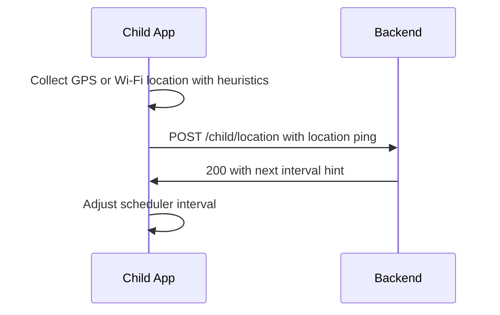

## Feature 02 — Background Location Tracking

### Overview
Continuously report device location with battery-aware intervals and accuracy controls.

### User Stories
- As a guardian, I can see recent and historical locations of the child.
- As a system, I throttle updates based on battery and motion.

### UI/UX
- Surfaces in `MainScreen.tsx` status tiles (Location: On/Off, Last ping time)
- Permission prompts on first run; diagnostics in `SettingsScreen.tsx`

### Frontend Mapping
- Service: `locationService` (background task)
- State: `location: { lastPing, accuracy, schedulerIntervalMs }`
- Components: `MainScreen`, `FloatingNotification`

### Data Models
- `LocationPing`: `{ lat, lon, accuracy, speed?, heading?, batteryPct, ts, source }`

### API Contracts
- POST `/api/v1/child/location` -> returns next interval hint (optional)
- GET `/api/v1/child/geofence/zones` (used for local checks)

### Sequence Diagram

### Algorithm Notes
- Adaptive intervals: 15-60s in motion; 2-5min idle; longer on low battery
- Batch sends when offline; compress payloads if batching

### Acceptance Criteria
- Median ping within target intervals
- Graceful behavior offline; retry with backoff
