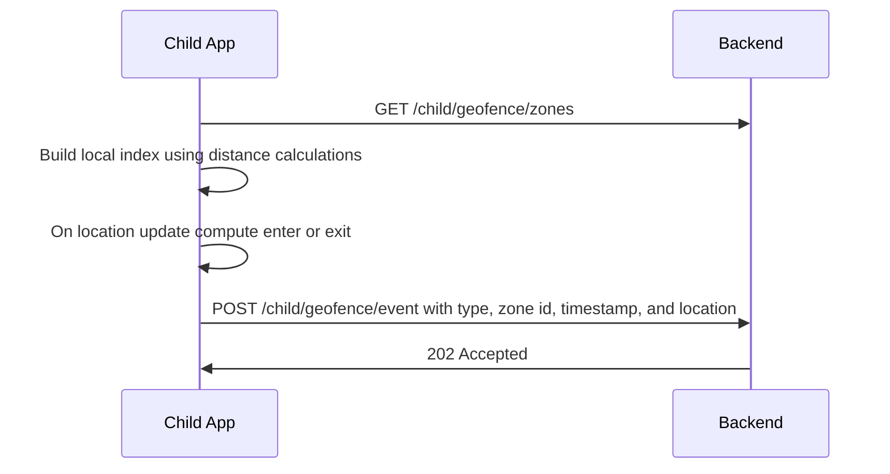

## Feature 03 — Geofencing & Safe Zones

### Overview
Monitor entry/exit of server-defined zones locally and emit events.

### User Stories
- As a guardian, I get alerts when my child enters/exits school/home.
- As a child app, I compute geofence locally to save data and latency.

### UI/UX
- Read-only list in `ScheduleScreen.tsx` or `SettingsScreen.tsx` (optional)
- Non-intrusive toasts for events (child-visible optional)

### Frontend Mapping
- Service: `geofenceService` uses zones + location stream
- State: `zones: GeofenceZone[]`, `lastEvents: GeofenceEvent[]`

### Data Models
- `GeofenceZone`: `{ zoneId, name, center: {lat, lon}, radiusM, schedule? }`
- `GeofenceEvent`: `{ eventId?, zoneId, type: 'enter'|'exit', ts, location }`

### API Contracts
- GET `/api/v1/child/geofence/zones` -> returns list of zones
- POST `/api/v1/child/geofence/event` -> returns accepted

### Sequence Diagram

### Algorithm Notes
- Debounce boundary oscillation; require dwell time (e.g., 15-30s)
- Honor schedules; suppress events outside active windows

### Acceptance Criteria
- Accurate enter/exit within +/- 50m typical GPS
- No event spam near boundaries
