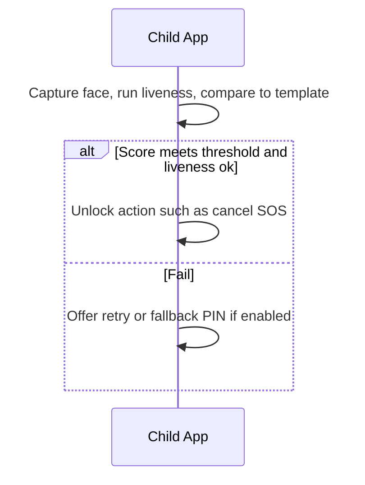

## Feature 06 — Trusted Face Verification (Optional)

### Overview
Local face verification to confirm SOS cancel or access guarded settings. Privacy-first with on-device templates.

### User Stories
- As a child, I can quickly cancel SOS with a trusted face check.
- As a guardian, I can require face verification for sensitive actions.

### UI/UX
- Screen: `TrustedFaceScanScreen.tsx`
- Flow: Prompt -> camera preview -> liveness check (blink or move) -> match score -> pass or fail

### Frontend Mapping
- Service: `faceVerificationService`
- State: `face: { enrolled: boolean, lastScore?, lastResult? }`

### Data Models
- `FaceTemplate`: on-device vector; never leaves device by default
- `FaceAttempt`: `{ score, livenessPassed, ts }`

### API Contracts
- Optional server backup: POST `/api/v1/child/face/backup` (encrypted blob) with explicit consent

### Sequence Diagram

### Privacy & Security
- Templates stored in secure enclave/keystore if available
- No network calls unless explicit backup is enabled

### Acceptance Criteria
- Verification < 1.5s under normal light
- False accept/reject rates within target thresholds
