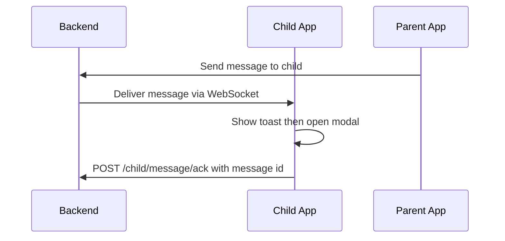

## Feature 07 — Parent Messaging & Acknowledgement

### Overview
Receive critical messages/commands from guardians; show minimal UI; send acknowledgement.

### User Stories
- As a guardian, I can send an instruction that the child app receives promptly.
- As a child app, I confirm receipt and display it unobtrusively.

### UI/UX
- Components: `ChatModal.tsx`, `FloatingNotification.tsx`
- Behaviors: banner toast -> tap opens modal -> acknowledge button

### Frontend Mapping
- WS client subscribes to `message` topic on `wss /child/realtime`
- State: `messages: Message[]`

### Data Models
- `Message`: `{ msgId, type, title, body, action?, sentAt, readAt? }`

### API Contracts
- WebSocket: message events
- POST `/api/v1/child/message/ack` -> acknowledge message by id

### Sequence Diagram

### Acceptance Criteria
- WS reconnects; no message loss (server retains until ack)
- Acks idempotent
