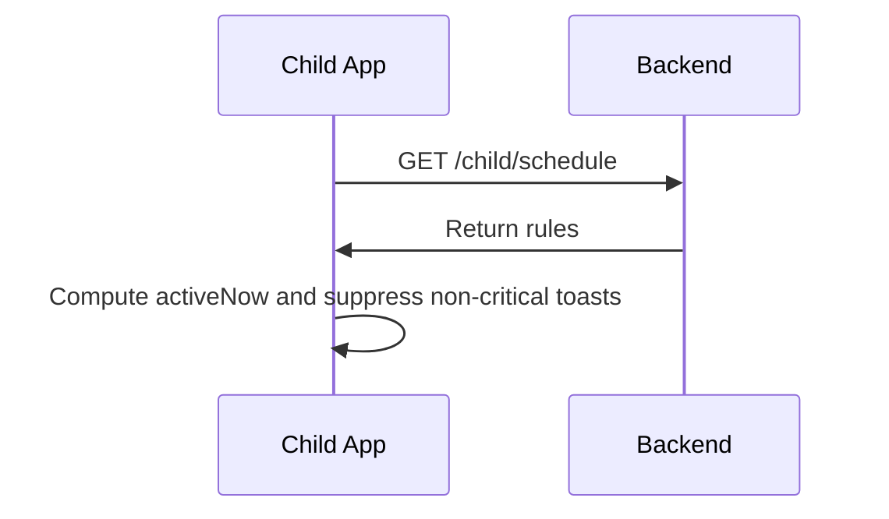

## Feature 08 — Schedules & Quiet Hours

### Overview
Honor guardian-defined schedules to reduce distractions; suppress non-critical notifications.

### User Stories
- As a guardian, I can define quiet hours for school/night.
- As a child app, I respect schedules automatically.

### UI/UX
- Screen: `ScheduleScreen.tsx` (read-only)
- Indicators on `MainScreen`: Quiet Hours active badge

### Frontend Mapping
- Service: `scheduleService`
- State: `schedule: { rules: ScheduleRule[], activeNow: boolean }`

### Data Models
- `ScheduleRule`: `{ ruleId, quietHours: [{day, start, end}] }`

### API Contracts
- GET `/api/v1/child/schedule` -> returns schedule rules

### Sequence Diagram

### Acceptance Criteria
- Quiet hours toggle reflects server truth within 1 refresh interval
- Critical alerts (SOS) are never suppressed
