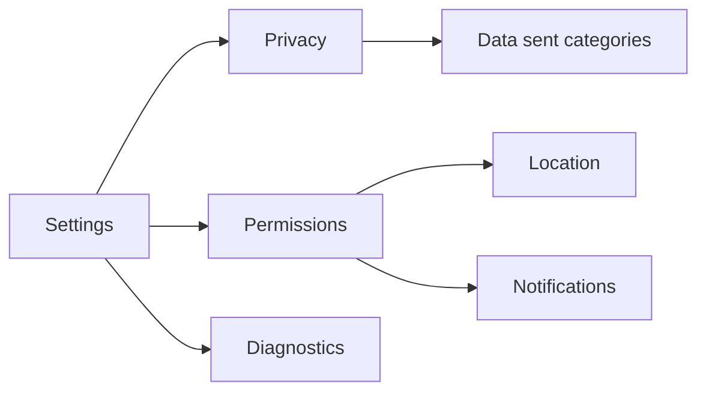

## Feature 10 — Settings, Privacy & Security

### Overview
Child-safe settings with clear privacy controls; secure token storage; diagnostics.

### User Stories
- As a child/guardian, I can view privacy info and diagnostics.
- As a system, I store tokens securely and enforce TLS.

### UI/UX
- Screen: `SettingsScreen.tsx`
- Sections: Privacy Info, Permissions, Diagnostics, Pairing Info

### Frontend Mapping
- State: `device`, `permissions`, `privacy: { dataSentCategories }`
- Actions: clear cache, re-pair, export diagnostics (optional)

### API Contracts
- Minimal; mostly local. Re-pair may call `/child/auth/pair`

### Diagram

### Acceptance Criteria
- Tokens stored in secure storage; never logged
- Privacy info matches actual telemetry
