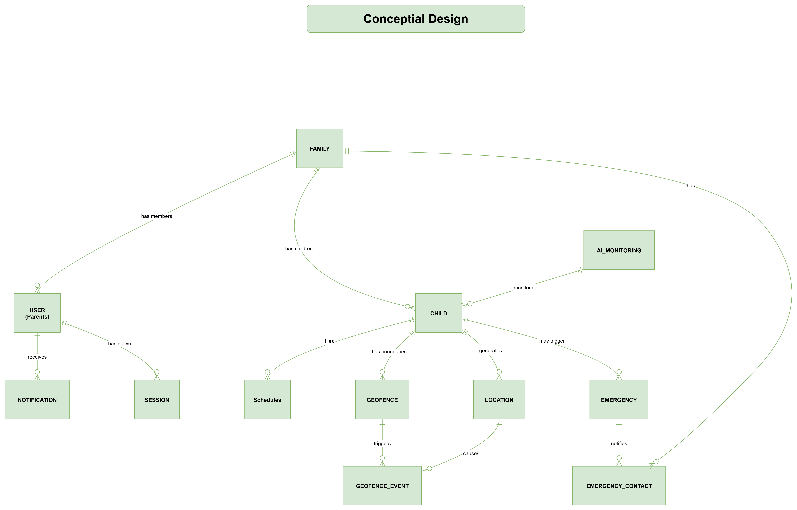

# SafeGuard Database Diagrams - Three Levels
## Conceptual, Logical, and Physical Database Design

### Table of Contents
1. [Conceptual Level Diagram](#conceptual-level-diagram)
2. [Logical Level Diagram](#logical-level-diagram)
3. [Physical Level Diagram](#physical-level-diagram)
---

## Conceptual Level Diagram

The conceptual level represents the high-level view of the SafeGuard system, focusing on the main entities and their relationships without implementation details.

### Conceptual ERD

[ERD drive Link](https://drive.google.com/file/d/1GzD_a6xIn534QhBVdmL688eCdJdMEi6K/view?usp=sharing)

### Conceptual Level Description

**Core Business Entities:**
1. **USER** - Parents, guardians, and family members
2. **FAMILY** - Family groups managing children
3. **CHILD** - Children being monitored and protected
4. **DEVICE** - Child devices (smartphones, smartwatches, trackers)
5. **LOCATION** - GPS coordinates and location data
6. **GEOFENCE** - Safe zones and restricted areas
7. **AI_MONITORING** - AI-powered safety monitoring
8. **NOTIFICATION** - Alerts and communications
9. **EMERGENCY_EVENT** - Crisis situations and responses

**Key Relationships:**
- Users belong to families with different roles
- Families contain multiple children
- Children are paired with devices
- Devices generate location data
- AI monitors children for safety
- Geofences monitor location compliance
- Notifications alert about events
- Emergency events trigger immediate responses

---

## Logical Level Diagram

The logical level adds more detail including attributes, data types, and business rules while remaining database-agnostic.

### Logical ERD

- still in progress