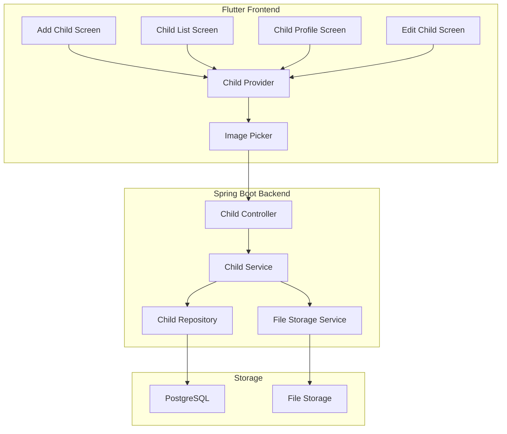
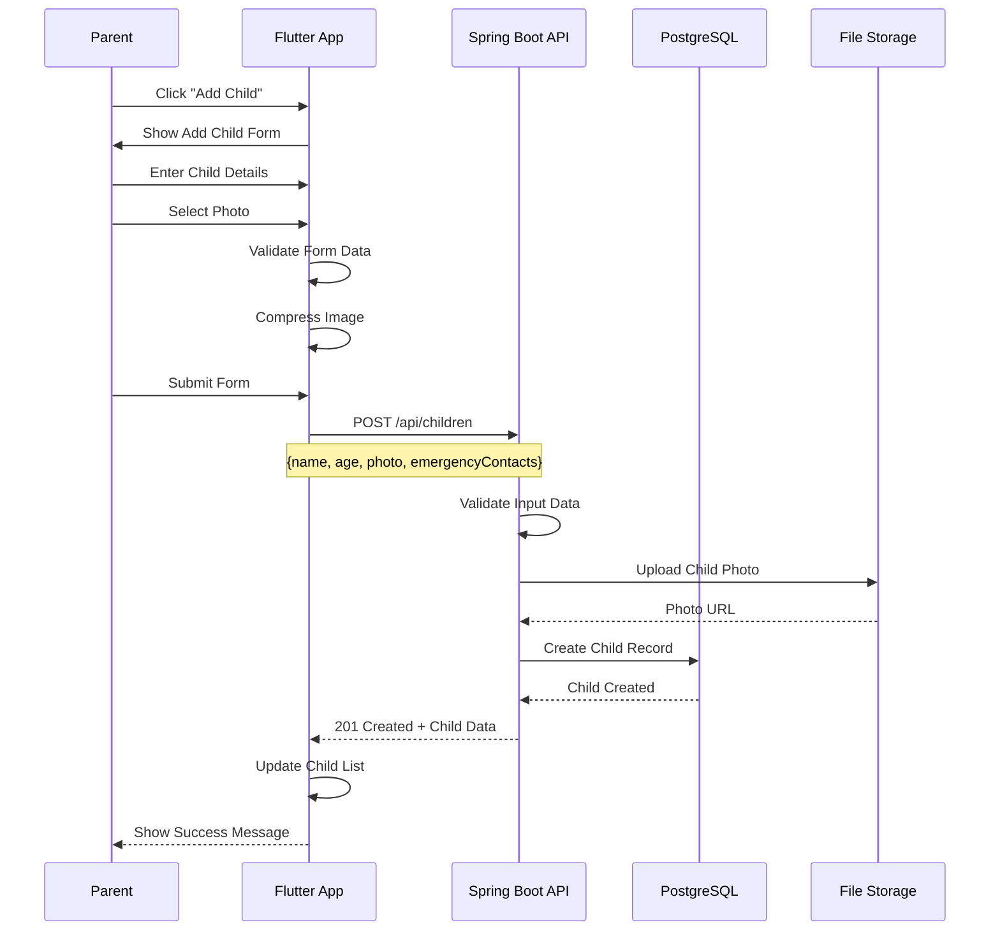
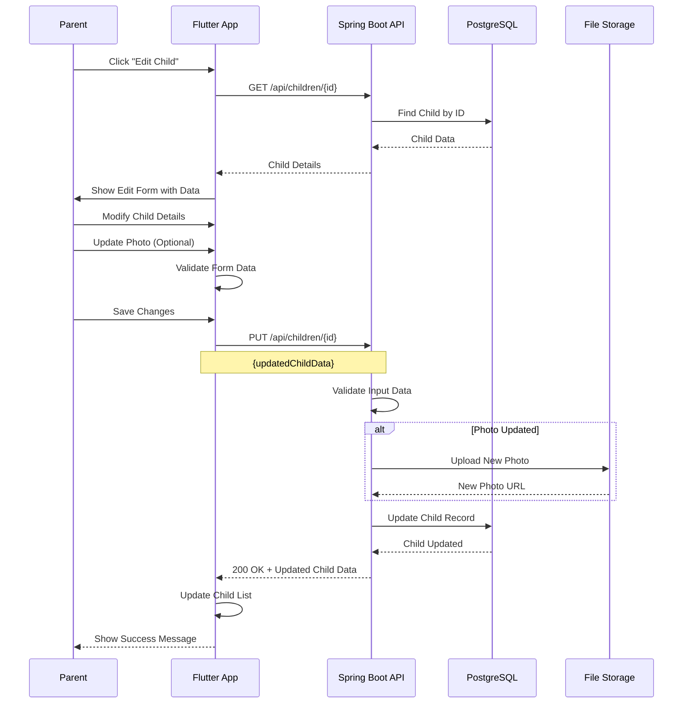

# Feature 02: Child Management

## Overview
This feature handles adding, editing, and managing child profiles in the SafeGuard Parent App. Parents can create detailed profiles for their children with photos, emergency contacts, and safety settings.

## Table of Contents
1. [Feature Requirements](#feature-requirements)
2. [System Architecture](#system-architecture)
3. [Sequence Diagrams](#sequence-diagrams)
4. [API Specifications](#api-specifications)
5. [Database Design](#database-design)
6. [Frontend Implementation consideration](#Frontend-Implementatio-(Flutter))
7. [Backend Implementation consideration](#Security-Considerations)

---

## Feature Requirements

### Functional Requirements
- **FR-01**: Parents can add new child profiles
- **FR-02**: Parents can edit existing child information
- **FR-03**: Parents can upload and manage child photos
- **FR-04**: Parents can set emergency contacts for each child
- **FR-05**: Parents can configure safety settings per child
- **FR-06**: Parents can view child profile details
- **FR-07**: Parents can delete child profiles
- **FR-08**: System validates child information
- **FR-09**: System supports multiple children per parent
- **FR-10**: System tracks child activity history

### Non-Functional Requirements
- **NFR-01**: Profile creation response time < 3 seconds
- **NFR-02**: Photo upload supports JPEG/PNG up to 5MB
- **NFR-03**: System supports up to 10 children per parent
- **NFR-04**: Data encryption for sensitive child information
- **NFR-05**: 99.9% uptime for child management services

---


### Component Diagram


---

## Sequence Diagrams

### Add Child Profile Flow


### Edit Child Profile Flow


---

## API Specifications

### Endpoints Table
| Method | Endpoint | Description | Request Body | Response | Status Codes | Auth Required |
|--------|----------|-------------|--------------|----------|--------------|---------------|
| GET | `/api/children` | Get all children | None | `List<ChildResponse>` | 200, 401 | Yes |
| GET | `/api/children/{id}` | Get child by ID | None | `ChildResponse` | 200, 404, 401 | Yes |
| POST | `/api/children` | Create new child | `CreateChildRequest` | `ChildResponse` | 201, 400, 401 | Yes |
| PUT | `/api/children/{id}` | Update child | `UpdateChildRequest` | `ChildResponse` | 200, 400, 404, 401 | Yes |
| DELETE | `/api/children/{id}` | Delete child | None | `MessageResponse` | 200, 404, 401 | Yes |
| POST | `/api/children/{id}/photo` | Upload child photo | `MultipartFile` | `PhotoResponse` | 200, 400, 401 | Yes |

### Request/Response Models

#### CreateChildRequest
```json
{
  "name": "string",
  "age": "integer",
  "dateOfBirth": "date",
  "gender": "MALE | FEMALE | OTHER",
  "allergies": "string",
  "medicalConditions": "string",
  "emergencyContacts": [
    {
      "name": "string",
      "phone": "string",
      "relationship": "string"
    }
  ],
  "safetySettings": {
    "allowLocationTracking": "boolean",
    "allowAudioMonitoring": "boolean",
    "allowVideoMonitoring": "boolean",
    "geofenceAlerts": "boolean"
  }
}
```

#### ChildResponse
```json
{
  "id": "string",
  "name": "string",
  "age": "integer",
  "dateOfBirth": "date",
  "gender": "string",
  "photoUrl": "string",
  "allergies": "string",
  "medicalConditions": "string",
  "emergencyContacts": [
    {
      "id": "string",
      "name": "string",
      "phone": "string",
      "relationship": "string"
    }
  ],
  "safetySettings": {
    "allowLocationTracking": "boolean",
    "allowAudioMonitoring": "boolean",
    "allowVideoMonitoring": "boolean",
    "geofenceAlerts": "boolean"
  },
  "createdAt": "datetime",
  "updatedAt": "datetime"
}
```

---

## Database Design

### Children Table
```sql
CREATE TABLE children (
    id BIGSERIAL PRIMARY KEY,
    parent_id BIGINT NOT NULL REFERENCES users(id) ON DELETE CASCADE,
    name VARCHAR(100) NOT NULL,
    age INTEGER NOT NULL,
    date_of_birth DATE NOT NULL,
    gender VARCHAR(10) NOT NULL CHECK (gender IN ('MALE', 'FEMALE', 'OTHER')),
    photo_url VARCHAR(500),
    allergies TEXT,
    medical_conditions TEXT,
    is_active BOOLEAN NOT NULL DEFAULT true,
    created_at TIMESTAMP NOT NULL DEFAULT CURRENT_TIMESTAMP,
    updated_at TIMESTAMP NOT NULL DEFAULT CURRENT_TIMESTAMP
);

CREATE INDEX idx_children_parent_id ON children(parent_id);
CREATE INDEX idx_children_active ON children(is_active);
```

### Emergency Contacts Table
```sql
CREATE TABLE emergency_contacts (
    id BIGSERIAL PRIMARY KEY,
    child_id BIGINT NOT NULL REFERENCES children(id) ON DELETE CASCADE,
    name VARCHAR(100) NOT NULL,
    phone VARCHAR(20) NOT NULL,
    relationship VARCHAR(50) NOT NULL,
    is_primary BOOLEAN NOT NULL DEFAULT false,
    created_at TIMESTAMP NOT NULL DEFAULT CURRENT_TIMESTAMP
);

CREATE INDEX idx_emergency_contacts_child_id ON emergency_contacts(child_id);
```

### Child Safety Settings Table
```sql
CREATE TABLE child_safety_settings (
    id BIGSERIAL PRIMARY KEY,
    child_id BIGINT NOT NULL REFERENCES children(id) ON DELETE CASCADE,
    allow_location_tracking BOOLEAN NOT NULL DEFAULT true,
    allow_audio_monitoring BOOLEAN NOT NULL DEFAULT false,
    allow_video_monitoring BOOLEAN NOT NULL DEFAULT false,
    geofence_alerts BOOLEAN NOT NULL DEFAULT true,
    created_at TIMESTAMP NOT NULL DEFAULT CURRENT_TIMESTAMP,
    updated_at TIMESTAMP NOT NULL DEFAULT CURRENT_TIMESTAMP
);

CREATE UNIQUE INDEX idx_child_safety_settings_child_id ON child_safety_settings(child_id);
```

---

## Frontend Implementation (Flutter)

### Project Structure
```
lib/features/child_management/
├── data/
│   ├── datasources/
│   │   ├── child_local_datasource.dart
│   │   └── child_remote_datasource.dart
│   ├── models/
│   │   ├── child_model.dart
│   │   └── emergency_contact_model.dart
│   └── repositories/
│       └── child_repository_impl.dart
├── domain/
│   ├── entities/
│   │   ├── child.dart
│   │   └── emergency_contact.dart
│   ├── repositories/
│   │   └── child_repository.dart
│   └── usecases/
│       ├── add_child_usecase.dart
│       ├── update_child_usecase.dart
│       └── delete_child_usecase.dart
└── presentation/
    ├── pages/
    │   ├── add_child_page.dart
    │   ├── child_list_page.dart
    │   ├── child_profile_page.dart
    │   └── edit_child_page.dart
    ├── widgets/
    │   ├── child_card.dart
    │   ├── emergency_contact_form.dart
    │   └── safety_settings_form.dart
    └── providers/
        └── child_provider.dart
```

### Key Dependencies
```yaml
dependencies:
  # Image handling
  image_picker: ^1.0.4
  cached_network_image: ^3.3.0
  
  # File handling
  path_provider: ^2.1.1
  mime: ^1.0.4
  
  # State management
  flutter_riverpod: ^2.4.0
  
  # UI components
  flutter_form_builder: ^9.1.1
  form_builder_validators: ^9.1.0
```


## Security Considerations

### Data Protection
- **Encryption**: Sensitive child data encrypted at rest
- **Access Control**: Parents can only access their own children
- **Photo Security**: Child photos stored securely with access controls
- **Data Validation**: All input data validated and sanitized

### Privacy Compliance
- **COPPA Compliance**: Follows children's online privacy guidelines
- **Data Retention**: Clear data retention policies
- **Consent Management**: Proper consent for data collection
- **Right to Delete**: Parents can delete child data

---

## Testing Strategy

### Unit Tests
- **Service Layer**: Test child management business logic
- **Repository Layer**: Test data access methods
- **Validation**: Test input validation and constraints

### Integration Tests
- **API Endpoints**: Test complete CRUD operations
- **File Upload**: Test photo upload functionality
- **Database Operations**: Test data persistence

### Security Tests
- **Authorization**: Test access control mechanisms
- **Data Validation**: Test input sanitization
- **File Upload Security**: Test file type and size validation

This comprehensive feature documentation provides everything needed to implement the Child Management feature for the SafeGuard Parent App.
