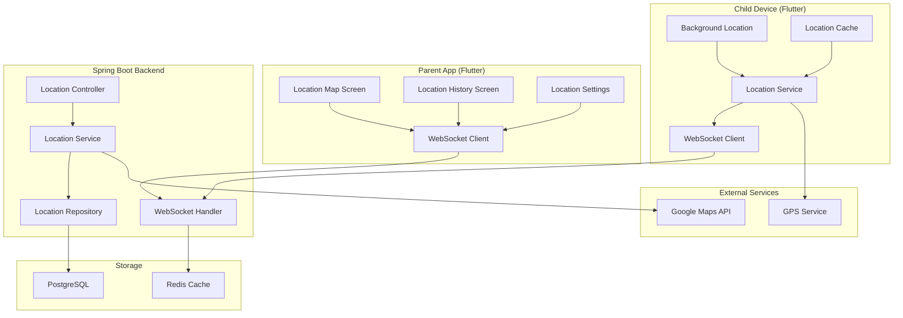
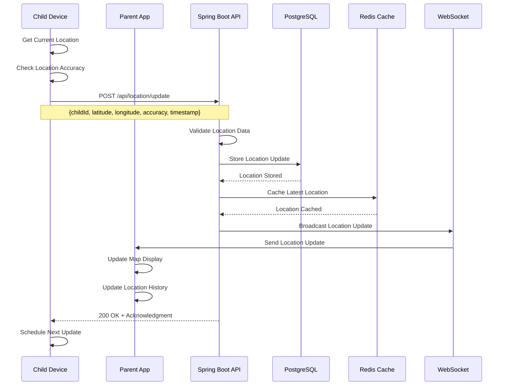
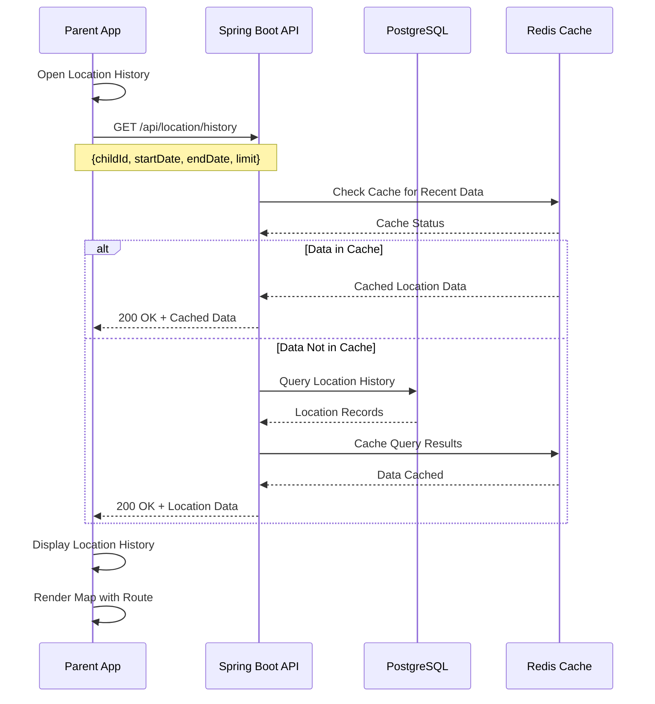
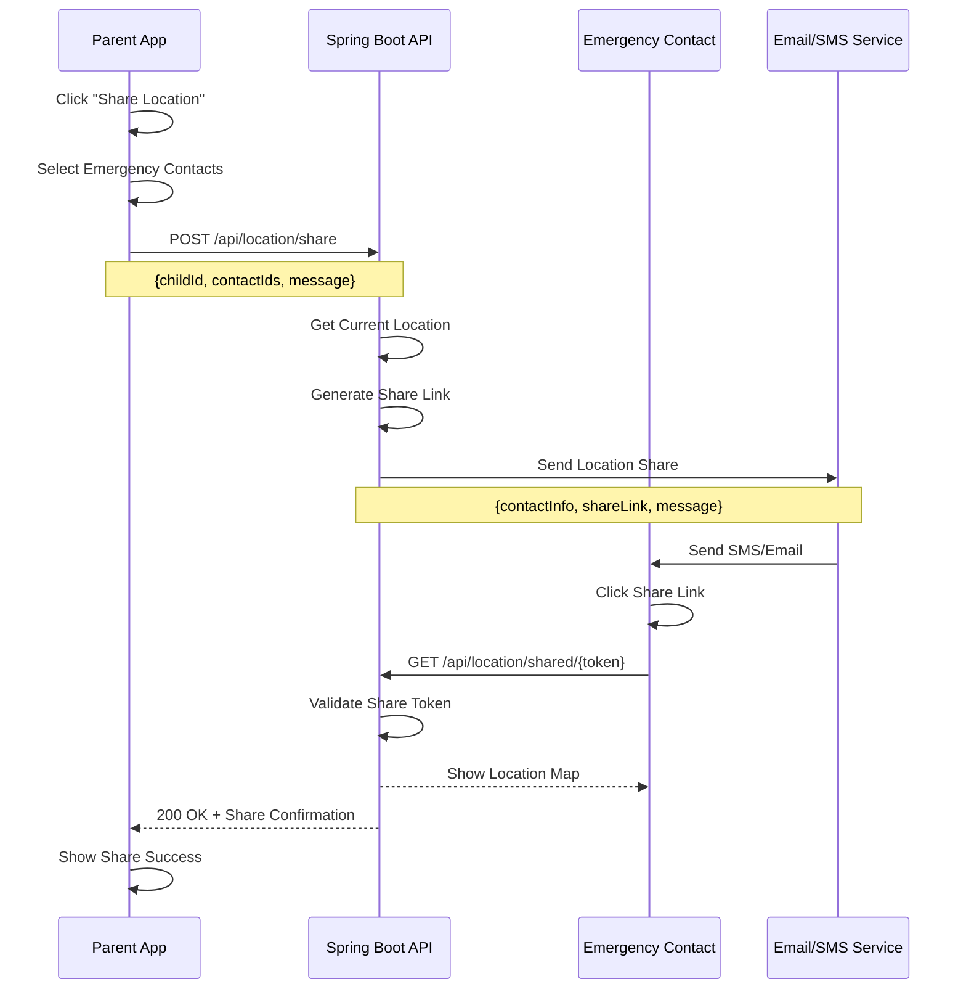

# Feature 03: Real-Time Location Tracking

## Overview
This feature provides real-time location tracking for children, allowing parents to monitor their children's whereabouts with live updates, location history, and safety alerts.

## Table of Contents
1. [Feature Requirements](#feature-requirements)
2. [System Architecture](#system-architecture)
3. [Sequence Diagrams](#sequence-diagrams)
4. [API Specifications](#api-specifications)
5. [Database Design](#database-design)
6. [Frontend Implementation](#frontend-implementation)
7. [Backend Implementation](#backend-implementation)

---

## Feature Requirements

### Functional Requirements
- **FR-01**: Parents can view real-time location of their children
- **FR-02**: System tracks location updates every 30 seconds
- **FR-03**: Parents can view location history
- **FR-04**: System shows location on interactive map
- **FR-05**: Parents can set location update frequency
- **FR-06**: System provides location accuracy indicators
- **FR-07**: Parents can share location with emergency contacts
- **FR-08**: System tracks movement patterns and routes
- **FR-09**: Parents can set location-based alerts
- **FR-10**: System works in background when app is closed

### Non-Functional Requirements
- **NFR-01**: Location update response time < 5 seconds
- **NFR-02**: System supports GPS, WiFi, and cellular positioning
- **NFR-03**: Location accuracy within 10 meters
- **NFR-04**: Battery usage optimization for child devices
- **NFR-05**: Offline location caching for 24 hours
- **NFR-06**: Real-time updates via WebSocket connection

---

## System Architecture

### Component Diagram


---

## Sequence Diagrams

### Real-Time Location Update Flow


### Location History Retrieval Flow


### Emergency Location Sharing Flow


---

## API Specifications

### Endpoints Table
| Method | Endpoint | Description | Request Body | Response | Status Codes | Auth Required |
|--------|----------|-------------|--------------|----------|--------------|---------------|
| POST | `/api/location/update` | Update child location | `LocationUpdateRequest` | `LocationResponse` | 200, 400, 401 | Yes |
| GET | `/api/location/current/{childId}` | Get current location | None | `LocationResponse` | 200, 404, 401 | Yes |
| GET | `/api/location/history` | Get location history | Query params | `List<LocationResponse>` | 200, 401 | Yes |
| POST | `/api/location/share` | Share location | `LocationShareRequest` | `MessageResponse` | 200, 400, 401 | Yes |
| GET | `/api/location/shared/{token}` | View shared location | None | `LocationResponse` | 200, 404 | No |
| PUT | `/api/location/settings` | Update tracking settings | `LocationSettingsRequest` | `MessageResponse` | 200, 400, 401 | Yes |
| GET | `/api/location/geofences/{childId}` | Get geofences | None | `List<GeofenceResponse>` | 200, 401 | Yes |

### Request/Response Models

#### LocationUpdateRequest
```json
{
  "childId": "string",
  "latitude": "number",
  "longitude": "number",
  "accuracy": "number",
  "altitude": "number",
  "speed": "number",
  "heading": "number",
  "timestamp": "datetime",
  "batteryLevel": "number",
  "locationSource": "GPS | NETWORK | PASSIVE"
}
```

#### LocationResponse
```json
{
  "id": "string",
  "childId": "string",
  "latitude": "number",
  "longitude": "number",
  "accuracy": "number",
  "altitude": "number",
  "speed": "number",
  "heading": "number",
  "timestamp": "datetime",
  "batteryLevel": "number",
  "locationSource": "string",
  "address": {
    "street": "string",
    "city": "string",
    "state": "string",
    "country": "string",
    "postalCode": "string"
  }
}
```

#### LocationShareRequest
```json
{
  "childId": "string",
  "contactIds": ["string"],
  "message": "string",
  "expiryHours": "number",
  "includeHistory": "boolean"
}
```

---

## Database Design

### Location Updates Table
```sql
CREATE TABLE location_updates (
    id BIGSERIAL PRIMARY KEY,
    child_id BIGINT NOT NULL REFERENCES children(id) ON DELETE CASCADE,
    latitude DECIMAL(10, 8) NOT NULL,
    longitude DECIMAL(11, 8) NOT NULL,
    accuracy DECIMAL(8, 2),
    altitude DECIMAL(8, 2),
    speed DECIMAL(8, 2),
    heading DECIMAL(8, 2),
    timestamp TIMESTAMP NOT NULL,
    battery_level INTEGER,
    location_source VARCHAR(20) NOT NULL,
    address_street VARCHAR(255),
    address_city VARCHAR(100),
    address_state VARCHAR(100),
    address_country VARCHAR(100),
    address_postal_code VARCHAR(20),
    created_at TIMESTAMP NOT NULL DEFAULT CURRENT_TIMESTAMP
);

CREATE INDEX idx_location_updates_child_id ON location_updates(child_id);
CREATE INDEX idx_location_updates_timestamp ON location_updates(timestamp);
CREATE INDEX idx_location_updates_location ON location_updates(latitude, longitude);
```

### Location Settings Table
```sql
CREATE TABLE location_settings (
    id BIGSERIAL PRIMARY KEY,
    child_id BIGINT NOT NULL REFERENCES children(id) ON DELETE CASCADE,
    update_frequency_seconds INTEGER NOT NULL DEFAULT 30,
    accuracy_threshold_meters INTEGER NOT NULL DEFAULT 10,
    battery_optimization BOOLEAN NOT NULL DEFAULT true,
    background_tracking BOOLEAN NOT NULL DEFAULT true,
    wifi_tracking BOOLEAN NOT NULL DEFAULT true,
    cellular_tracking BOOLEAN NOT NULL DEFAULT true,
    created_at TIMESTAMP NOT NULL DEFAULT CURRENT_TIMESTAMP,
    updated_at TIMESTAMP NOT NULL DEFAULT CURRENT_TIMESTAMP
);

CREATE UNIQUE INDEX idx_location_settings_child_id ON location_settings(child_id);
```

### Location Shares Table
```sql
CREATE TABLE location_shares (
    id BIGSERIAL PRIMARY KEY,
    child_id BIGINT NOT NULL REFERENCES children(id) ON DELETE CASCADE,
    share_token VARCHAR(255) UNIQUE NOT NULL,
    contact_phone VARCHAR(20),
    contact_email VARCHAR(255),
    message TEXT,
    expires_at TIMESTAMP NOT NULL,
    is_active BOOLEAN NOT NULL DEFAULT true,
    created_at TIMESTAMP NOT NULL DEFAULT CURRENT_TIMESTAMP
);

CREATE INDEX idx_location_shares_token ON location_shares(share_token);
CREATE INDEX idx_location_shares_child_id ON location_shares(child_id);
```

---

## Frontend Implementation (Flutter)

### Project Structure
```
lib/features/location_tracking/
├── data/
│   ├── datasources/
│   │   ├── location_local_datasource.dart
│   │   └── location_remote_datasource.dart
│   ├── models/
│   │   ├── location_model.dart
│   │   └── location_settings_model.dart
│   └── repositories/
│       └── location_repository_impl.dart
├── domain/
│   ├── entities/
│   │   ├── location.dart
│   │   └── location_settings.dart
│   ├── repositories/
│   │   └── location_repository.dart
│   └── usecases/
│       ├── update_location_usecase.dart
│       ├── get_location_history_usecase.dart
│       └── share_location_usecase.dart
└── presentation/
    ├── pages/
    │   ├── location_map_page.dart
    │   ├── location_history_page.dart
    │   └── location_settings_page.dart
    ├── widgets/
    │   ├── location_map_widget.dart
    │   ├── location_history_widget.dart
    │   └── location_share_widget.dart
    └── providers/
        └── location_provider.dart
```

### Key Dependencies
```yaml
dependencies:
  # Location services
  geolocator: ^10.1.0
  geocoding: ^2.1.1
  location: ^5.0.3
  
  # Maps
  google_maps_flutter: ^2.5.0
  google_polyline_algorithm: ^3.1.0
  
  # WebSocket
  web_socket_channel: ^2.4.0
  
  # Background tasks
  workmanager: ^0.5.1
  
  # State management
  flutter_riverpod: ^2.4.0
```

## Security Considerations

### Location Data Protection
- **Encryption**: Location data encrypted in transit and at rest
- **Access Control**: Parents can only access their children's locations
- **Data Retention**: Location history automatically purged after 30 days
- **Anonymization**: Shared locations use temporary tokens

### Privacy Compliance
- **Consent Management**: Clear consent for location tracking
- **Data Minimization**: Only necessary location data collected
- **Right to Delete**: Parents can delete location history
- **Transparency**: Clear information about data usage

---

## Testing Strategy

### Unit Tests
- **Service Layer**: Test location management business logic
- **Repository Layer**: Test data access methods
- **WebSocket**: Test real-time communication

### Integration Tests
- **API Endpoints**: Test location CRUD operations
- **WebSocket**: Test real-time updates
- **Geocoding**: Test address resolution

### Performance Tests
- **Location Updates**: Test high-frequency updates
- **WebSocket**: Test concurrent connections
- **Database**: Test location history queries

This comprehensive feature documentation provides everything needed to implement the Real-Time Location Tracking feature for the SafeGuard Parent App.
