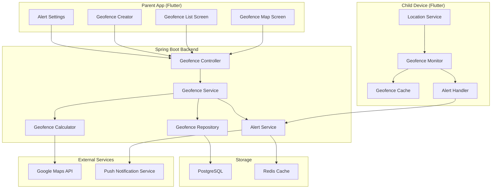
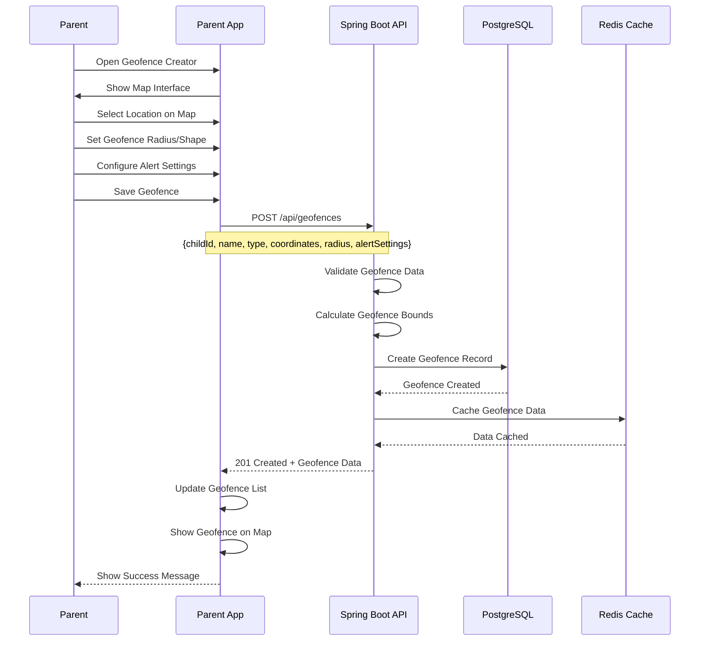
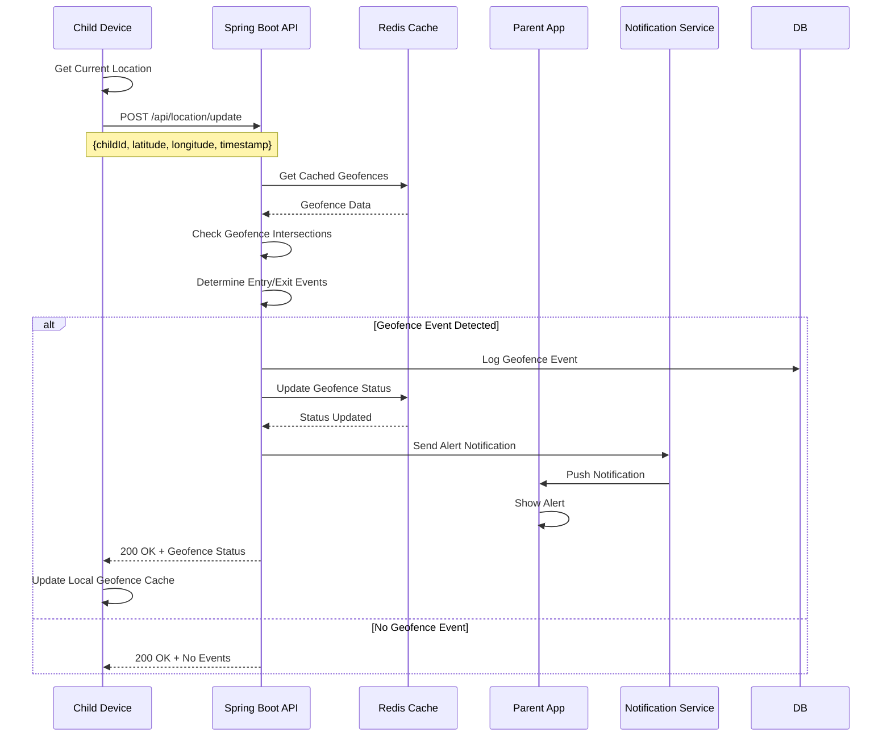
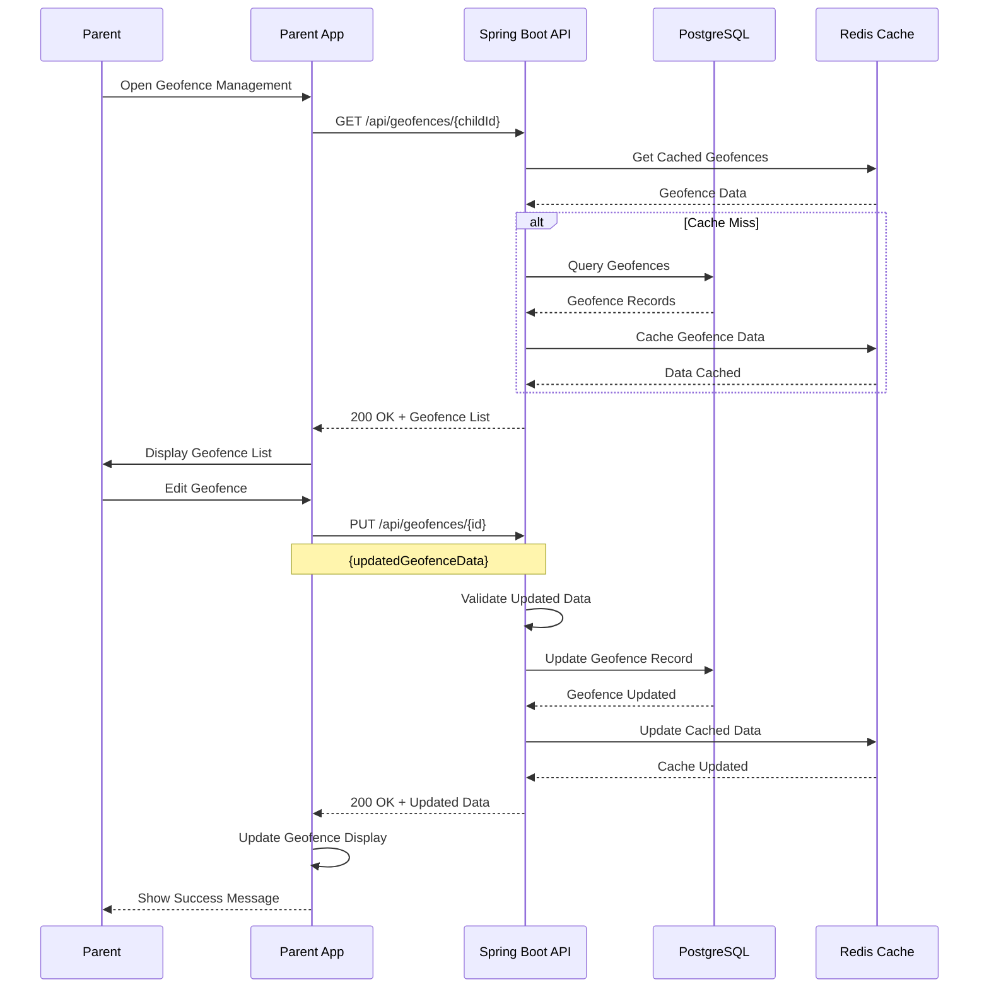

# Feature 04: Geofencing & Safe Zones

## Overview
This feature allows parents to create virtual boundaries (geofences) around specific locations and receive alerts when children enter or exit these zones. It provides customizable safe zones with different alert types and notification preferences.

## Table of Contents
1. [Feature Requirements](#feature-requirements)
2. [System Architecture](#system-architecture)
3. [Sequence Diagrams](#sequence-diagrams)
4. [API Specifications](#api-specifications)
5. [Database Design](#database-design)
6. [Frontend Implementation](#frontend-implementation)
7. [Backend Implementation](#backend-implementation)

---

## Feature Requirements

### Functional Requirements
- **FR-01**: Parents can create circular geofences around specific locations
- **FR-02**: Parents can create polygonal geofences with custom shapes
- **FR-03**: System detects when child enters a geofence
- **FR-04**: System detects when child exits a geofence
- **FR-05**: Parents can set different alert types for each geofence
- **FR-06**: Parents can configure notification preferences
- **FR-07**: System supports multiple geofences per child
- **FR-08**: Parents can edit or delete existing geofences
- **FR-09**: System provides geofence status dashboard
- **FR-10**: Parents can set geofence activation schedules

### Non-Functional Requirements
- **NFR-01**: Geofence detection accuracy within 50 meters
- **NFR-02**: Alert delivery time < 30 seconds
- **NFR-03**: System supports up to 20 geofences per child
- **NFR-04**: Geofence calculations optimized for battery life
- **NFR-05**: Offline geofence detection capability
- **NFR-06**: Real-time geofence status updates

---

## System Architecture

### Component Diagram


---

## Sequence Diagrams

### Geofence Creation Flow


### Geofence Detection Flow


### Geofence Management Flow


---

## API Specifications

### Endpoints Table
| Method | Endpoint | Description | Request Body | Response | Status Codes | Auth Required |
|--------|----------|-------------|--------------|----------|--------------|---------------|
| GET | `/api/geofences/{childId}` | Get geofences for child | None | `List<GeofenceResponse>` | 200, 401 | Yes |
| POST | `/api/geofences` | Create new geofence | `CreateGeofenceRequest` | `GeofenceResponse` | 201, 400, 401 | Yes |
| PUT | `/api/geofences/{id}` | Update geofence | `UpdateGeofenceRequest` | `GeofenceResponse` | 200, 400, 404, 401 | Yes |
| DELETE | `/api/geofences/{id}` | Delete geofence | None | `MessageResponse` | 200, 404, 401 | Yes |
| GET | `/api/geofences/{id}/status` | Get geofence status | None | `GeofenceStatusResponse` | 200, 404, 401 | Yes |
| POST | `/api/geofences/{id}/test` | Test geofence with location | `TestGeofenceRequest` | `GeofenceTestResponse` | 200, 400, 401 | Yes |
| GET | `/api/geofences/events` | Get geofence events | Query params | `List<GeofenceEventResponse>` | 200, 401 | Yes |

### Request/Response Models

#### CreateGeofenceRequest
```json
{
  "childId": "string",
  "name": "string",
  "description": "string",
  "type": "CIRCULAR | POLYGON",
  "coordinates": {
    "center": {
      "latitude": "number",
      "longitude": "number"
    },
    "radius": "number",
    "polygon": [
      {
        "latitude": "number",
        "longitude": "number"
      }
    ]
  },
  "alertSettings": {
    "entryAlert": "boolean",
    "exitAlert": "boolean",
    "alertType": "PUSH | SMS | EMAIL",
    "alertMessage": "string",
    "quietHours": {
      "enabled": "boolean",
      "startTime": "string",
      "endTime": "string"
    }
  },
  "schedule": {
    "enabled": "boolean",
    "daysOfWeek": ["MONDAY", "TUESDAY", "WEDNESDAY"],
    "startTime": "string",
    "endTime": "string"
  }
}
```

#### GeofenceResponse
```json
{
  "id": "string",
  "childId": "string",
  "name": "string",
  "description": "string",
  "type": "string",
  "coordinates": {
    "center": {
      "latitude": "number",
      "longitude": "number"
    },
    "radius": "number",
    "polygon": [
      {
        "latitude": "number",
        "longitude": "number"
      }
    ]
  },
  "alertSettings": {
    "entryAlert": "boolean",
    "exitAlert": "boolean",
    "alertType": "string",
    "alertMessage": "string",
    "quietHours": {
      "enabled": "boolean",
      "startTime": "string",
      "endTime": "string"
    }
  },
  "schedule": {
    "enabled": "boolean",
    "daysOfWeek": ["string"],
    "startTime": "string",
    "endTime": "string"
  },
  "isActive": "boolean",
  "createdAt": "datetime",
  "updatedAt": "datetime"
}
```

#### GeofenceEventResponse
```json
{
  "id": "string",
  "geofenceId": "string",
  "childId": "string",
  "eventType": "ENTRY | EXIT",
  "location": {
    "latitude": "number",
    "longitude": "number"
  },
  "timestamp": "datetime",
  "alertSent": "boolean",
  "alertType": "string"
}
```

---

## Database Design

### Geofences Table
```sql
CREATE TABLE geofences (
    id BIGSERIAL PRIMARY KEY,
    child_id BIGINT NOT NULL REFERENCES children(id) ON DELETE CASCADE,
    name VARCHAR(100) NOT NULL,
    description TEXT,
    type VARCHAR(20) NOT NULL CHECK (type IN ('CIRCULAR', 'POLYGON')),
    center_latitude DECIMAL(10, 8),
    center_longitude DECIMAL(11, 8),
    radius_meters INTEGER,
    polygon_coordinates JSONB,
    entry_alert BOOLEAN NOT NULL DEFAULT true,
    exit_alert BOOLEAN NOT NULL DEFAULT true,
    alert_type VARCHAR(20) NOT NULL DEFAULT 'PUSH',
    alert_message TEXT,
    quiet_hours_enabled BOOLEAN NOT NULL DEFAULT false,
    quiet_hours_start TIME,
    quiet_hours_end TIME,
    schedule_enabled BOOLEAN NOT NULL DEFAULT false,
    schedule_days JSONB,
    schedule_start_time TIME,
    schedule_end_time TIME,
    is_active BOOLEAN NOT NULL DEFAULT true,
    created_at TIMESTAMP NOT NULL DEFAULT CURRENT_TIMESTAMP,
    updated_at TIMESTAMP NOT NULL DEFAULT CURRENT_TIMESTAMP
);

CREATE INDEX idx_geofences_child_id ON geofences(child_id);
CREATE INDEX idx_geofences_active ON geofences(is_active);
CREATE INDEX idx_geofences_location ON geofences(center_latitude, center_longitude);
```

### Geofence Events Table
```sql
CREATE TABLE geofence_events (
    id BIGSERIAL PRIMARY KEY,
    geofence_id BIGINT NOT NULL REFERENCES geofences(id) ON DELETE CASCADE,
    child_id BIGINT NOT NULL REFERENCES children(id) ON DELETE CASCADE,
    event_type VARCHAR(10) NOT NULL CHECK (event_type IN ('ENTRY', 'EXIT')),
    latitude DECIMAL(10, 8) NOT NULL,
    longitude DECIMAL(11, 8) NOT NULL,
    timestamp TIMESTAMP NOT NULL,
    alert_sent BOOLEAN NOT NULL DEFAULT false,
    alert_type VARCHAR(20),
    created_at TIMESTAMP NOT NULL DEFAULT CURRENT_TIMESTAMP
);

CREATE INDEX idx_geofence_events_geofence_id ON geofence_events(geofence_id);
CREATE INDEX idx_geofence_events_child_id ON geofence_events(child_id);
CREATE INDEX idx_geofence_events_timestamp ON geofence_events(timestamp);
CREATE INDEX idx_geofence_events_type ON geofence_events(event_type);
```

### Geofence Status Table
```sql
CREATE TABLE geofence_status (
    id BIGSERIAL PRIMARY KEY,
    geofence_id BIGINT NOT NULL REFERENCES geofences(id) ON DELETE CASCADE,
    child_id BIGINT NOT NULL REFERENCES children(id) ON DELETE CASCADE,
    is_inside BOOLEAN NOT NULL DEFAULT false,
    last_location_latitude DECIMAL(10, 8),
    last_location_longitude DECIMAL(11, 8),
    last_check_timestamp TIMESTAMP NOT NULL,
    updated_at TIMESTAMP NOT NULL DEFAULT CURRENT_TIMESTAMP
);

CREATE UNIQUE INDEX idx_geofence_status_geofence_child ON geofence_status(geofence_id, child_id);
CREATE INDEX idx_geofence_status_child_id ON geofence_status(child_id);
```

---

## Frontend Implementation (Flutter)

### Project Structure
```
lib/features/geofencing/
├── data/
│   ├── datasources/
│   │   ├── geofence_local_datasource.dart
│   │   └── geofence_remote_datasource.dart
│   ├── models/
│   │   ├── geofence_model.dart
│   │   └── geofence_event_model.dart
│   └── repositories/
│       └── geofence_repository_impl.dart
├── domain/
│   ├── entities/
│   │   ├── geofence.dart
│   │   └── geofence_event.dart
│   ├── repositories/
│   │   └── geofence_repository.dart
│   └── usecases/
│       ├── create_geofence_usecase.dart
│       ├── update_geofence_usecase.dart
│       └── delete_geofence_usecase.dart
└── presentation/
    ├── pages/
    │   ├── geofence_map_page.dart
    │   ├── geofence_list_page.dart
    │   ├── create_geofence_page.dart
    │   └── geofence_settings_page.dart
    ├── widgets/
    │   ├── geofence_map_widget.dart
    │   ├── geofence_creator_widget.dart
    │   └── geofence_card.dart
    └── providers/
        └── geofence_provider.dart
```

### Key Dependencies
```yaml
dependencies:
  # Maps and location
  google_maps_flutter: ^2.5.0
  geolocator: ^10.1.0
  
  # Geofencing
  geofence: ^2.0.0
  
  # State management
  flutter_riverpod: ^2.4.0
  
  # UI components
  flutter_form_builder: ^9.1.1
  form_builder_validators: ^9.1.0
```


## Security Considerations

### Geofence Data Protection
- **Access Control**: Parents can only manage their children's geofences
- **Data Validation**: All geofence coordinates validated for accuracy
- **Rate Limiting**: Limit geofence creation and updates
- **Audit Logging**: Track all geofence modifications

### Privacy Compliance
- **Location Privacy**: Geofence data encrypted and secured
- **Data Retention**: Geofence events automatically purged after 90 days
- **Consent Management**: Clear consent for geofence monitoring
- **Right to Delete**: Parents can delete geofence data

---

## Testing Strategy

### Unit Tests
- **Service Layer**: Test geofence management business logic
- **Calculator Service**: Test geofence intersection calculations
- **Alert Service**: Test alert sending functionality

### Integration Tests
- **API Endpoints**: Test geofence CRUD operations
- **WebSocket**: Test real-time geofence updates
- **Database**: Test geofence data persistence

### Performance Tests
- **Geofence Calculations**: Test intersection calculations with large datasets
- **Real-time Updates**: Test geofence detection performance
- **Database Queries**: Test geofence query performance
