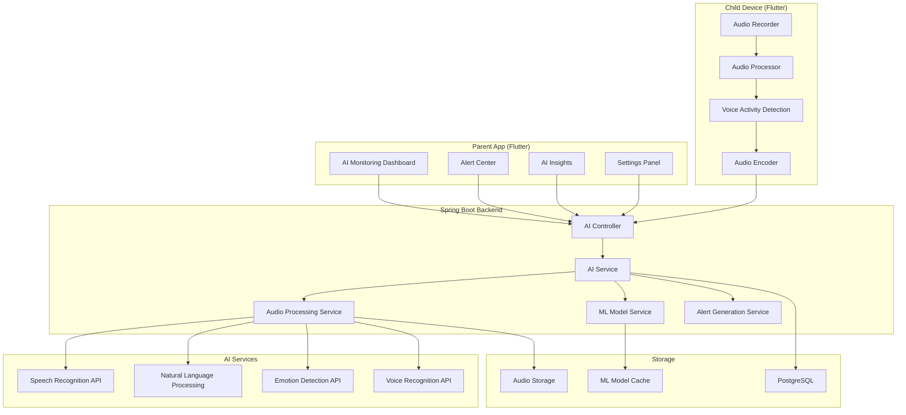
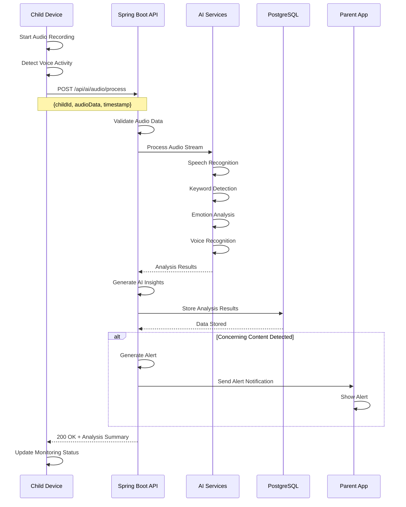
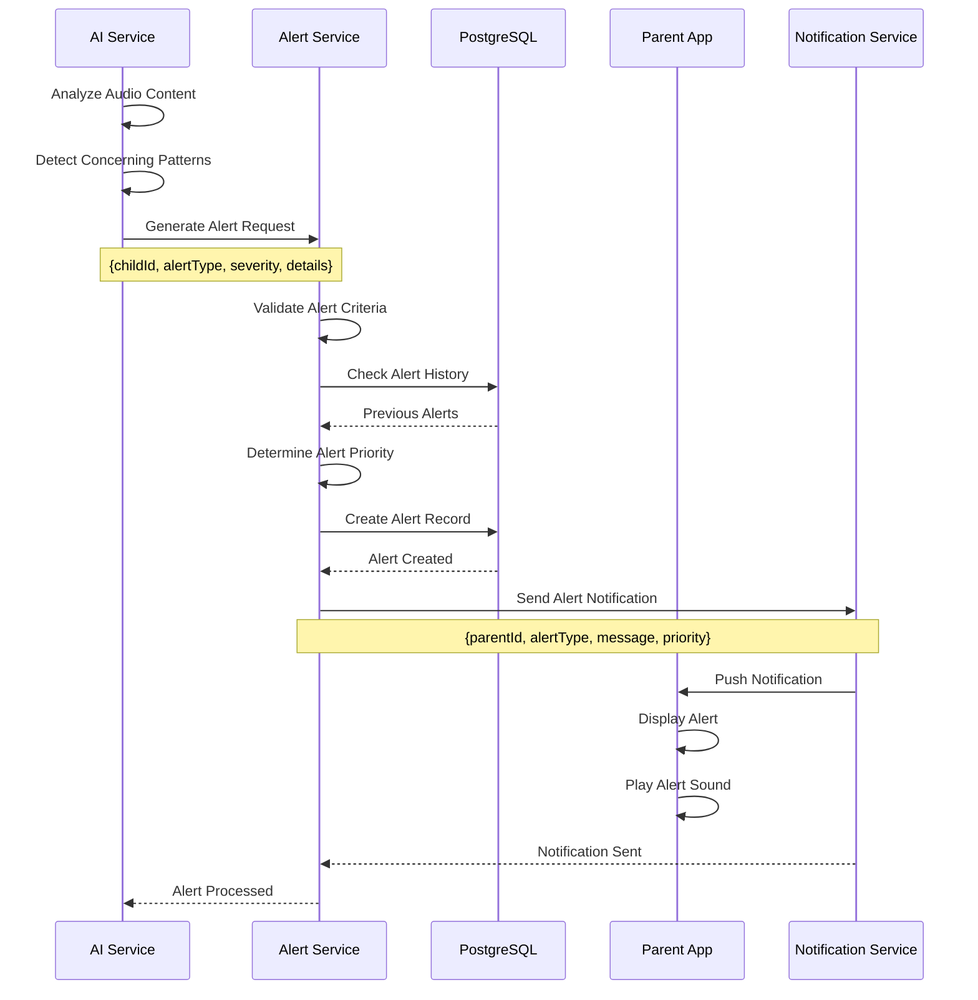
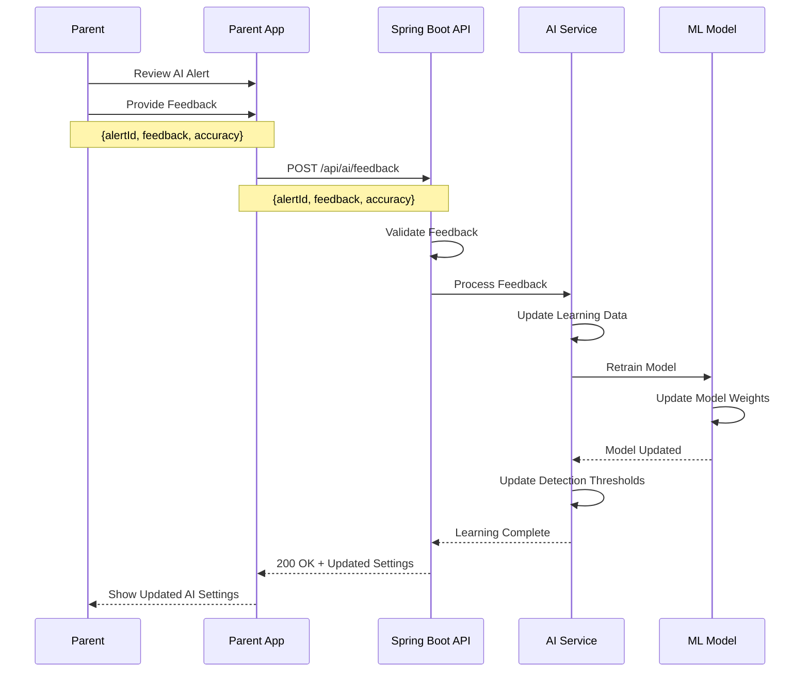

# Feature 05: AI-Powered Monitoring

## Overview
This feature provides intelligent monitoring capabilities using AI to analyze audio, detect keywords, monitor behavioral patterns, and provide smart alerts for child safety. It includes voice recognition, emotion detection, and predictive analytics.

## Table of Contents
1. [Feature Requirements](#feature-requirements)
2. [System Architecture](#system-architecture)
3. [Sequence Diagrams](#sequence-diagrams)
4. [API Specifications](#api-specifications)
5. [Database Design](#database-design)
6. [Frontend Implementation](#frontend-implementation)
7. [Backend Implementation](#backend-implementation)

---

## Feature Requirements

### Functional Requirements
- **FR-01**: System can detect and analyze audio from child devices
- **FR-02**: AI can identify concerning keywords and phrases
- **FR-03**: System can detect emotional states from voice analysis
- **FR-04**: AI can recognize trusted vs unknown voices
- **FR-05**: System can monitor behavioral patterns and anomalies
- **FR-06**: AI can predict potential safety risks
- **FR-07**: System can generate smart alerts based on AI analysis
- **FR-08**: Parents can configure AI monitoring sensitivity levels
- **FR-09**: System can learn from parent feedback to improve accuracy
- **FR-10**: AI can provide insights and recommendations

### Non-Functional Requirements
- **NFR-01**: Audio processing response time < 5 seconds
- **NFR-02**: AI model accuracy > 90% for keyword detection
- **NFR-03**: System supports real-time audio streaming
- **NFR-04**: Audio data encrypted in transit and at rest
- **NFR-05**: AI processing optimized for mobile devices
- **NFR-06**: System supports multiple languages

---

## System Architecture

### Component Diagram


---

## Sequence Diagrams

### Audio Monitoring Flow


### AI Alert Generation Flow


### AI Learning Flow


---

## API Specifications

### Endpoints Table
| Method | Endpoint | Description | Request Body | Response | Status Codes | Auth Required |
|--------|----------|-------------|--------------|----------|--------------|---------------|
| POST | `/api/ai/audio/process` | Process audio data | `AudioProcessRequest` | `AudioAnalysisResponse` | 200, 400, 401 | Yes |
| GET | `/api/ai/insights/{childId}` | Get AI insights | None | `AIInsightsResponse` | 200, 401 | Yes |
| POST | `/api/ai/feedback` | Provide AI feedback | `AIFeedbackRequest` | `MessageResponse` | 200, 400, 401 | Yes |
| GET | `/api/ai/alerts` | Get AI alerts | Query params | `List<AIAlertResponse>` | 200, 401 | Yes |
| PUT | `/api/ai/settings` | Update AI settings | `AISettingsRequest` | `MessageResponse` | 200, 400, 401 | Yes |
| POST | `/api/ai/voice/register` | Register trusted voice | `VoiceRegistrationRequest` | `MessageResponse` | 200, 400, 401 | Yes |
| GET | `/api/ai/patterns/{childId}` | Get behavioral patterns | None | `BehaviorPatternResponse` | 200, 401 | Yes |

### Request/Response Models

#### AudioProcessRequest
```json
{
  "childId": "string",
  "audioData": "base64_encoded_audio",
  "audioFormat": "WAV | MP3 | AAC",
  "duration": "number",
  "timestamp": "datetime",
  "deviceInfo": {
    "deviceId": "string",
    "osVersion": "string",
    "appVersion": "string"
  }
}
```

#### AudioAnalysisResponse
```json
{
  "analysisId": "string",
  "childId": "string",
  "timestamp": "datetime",
  "speechRecognition": {
    "transcript": "string",
    "confidence": "number",
    "language": "string"
  },
  "keywordDetection": {
    "keywords": [
      {
        "word": "string",
        "confidence": "number",
        "category": "SAFETY | EMOTION | BEHAVIOR",
        "severity": "LOW | MEDIUM | HIGH"
      }
    ],
    "overallRisk": "LOW | MEDIUM | HIGH"
  },
  "emotionAnalysis": {
    "emotions": [
      {
        "emotion": "HAPPY | SAD | ANGRY | FEARFUL | SURPRISED",
        "confidence": "number"
      }
    ],
    "dominantEmotion": "string",
    "emotionalState": "POSITIVE | NEGATIVE | NEUTRAL"
  },
  "voiceRecognition": {
    "isTrustedVoice": "boolean",
    "voiceId": "string",
    "confidence": "number"
  },
  "alerts": [
    {
      "type": "KEYWORD_ALERT | EMOTION_ALERT | VOICE_ALERT",
      "severity": "LOW | MEDIUM | HIGH",
      "message": "string",
      "timestamp": "datetime"
    }
  ]
}
```

#### AIInsightsResponse
```json
{
  "childId": "string",
  "timeRange": {
    "startDate": "date",
    "endDate": "date"
  },
  "insights": {
    "emotionalTrends": [
      {
        "date": "date",
        "emotion": "string",
        "frequency": "number"
      }
    ],
    "keywordFrequency": [
      {
        "keyword": "string",
        "count": "number",
        "category": "string"
      }
    ],
    "behavioralPatterns": [
      {
        "pattern": "string",
        "frequency": "number",
        "riskLevel": "LOW | MEDIUM | HIGH"
      }
    ],
    "recommendations": [
      {
        "type": "SAFETY | EMOTIONAL | BEHAVIORAL",
        "message": "string",
        "priority": "LOW | MEDIUM | HIGH"
      }
    ]
  },
  "summary": {
    "totalAlerts": "number",
    "highRiskAlerts": "number",
    "emotionalState": "string",
    "safetyScore": "number"
  }
}
```

---

## Database Design

### AI Analysis Table
```sql
CREATE TABLE ai_analysis (
    id BIGSERIAL PRIMARY KEY,
    child_id BIGINT NOT NULL REFERENCES children(id) ON DELETE CASCADE,
    analysis_id VARCHAR(255) UNIQUE NOT NULL,
    audio_duration INTEGER,
    audio_format VARCHAR(10),
    speech_transcript TEXT,
    speech_confidence DECIMAL(3,2),
    language_detected VARCHAR(10),
    emotional_state VARCHAR(20),
    dominant_emotion VARCHAR(20),
    emotion_confidence DECIMAL(3,2),
    is_trusted_voice BOOLEAN,
    voice_id VARCHAR(255),
    voice_confidence DECIMAL(3,2),
    overall_risk_level VARCHAR(10),
    created_at TIMESTAMP NOT NULL DEFAULT CURRENT_TIMESTAMP
);

CREATE INDEX idx_ai_analysis_child_id ON ai_analysis(child_id);
CREATE INDEX idx_ai_analysis_timestamp ON ai_analysis(created_at);
CREATE INDEX idx_ai_analysis_risk_level ON ai_analysis(overall_risk_level);
```

### AI Keywords Table
```sql
CREATE TABLE ai_keywords (
    id BIGSERIAL PRIMARY KEY,
    analysis_id BIGINT NOT NULL REFERENCES ai_analysis(id) ON DELETE CASCADE,
    keyword VARCHAR(100) NOT NULL,
    confidence DECIMAL(3,2) NOT NULL,
    category VARCHAR(20) NOT NULL,
    severity VARCHAR(10) NOT NULL,
    context TEXT,
    created_at TIMESTAMP NOT NULL DEFAULT CURRENT_TIMESTAMP
);

CREATE INDEX idx_ai_keywords_analysis_id ON ai_keywords(analysis_id);
CREATE INDEX idx_ai_keywords_category ON ai_keywords(category);
CREATE INDEX idx_ai_keywords_severity ON ai_keywords(severity);
```

### AI Alerts Table
```sql
CREATE TABLE ai_alerts (
    id BIGSERIAL PRIMARY KEY,
    child_id BIGINT NOT NULL REFERENCES children(id) ON DELETE CASCADE,
    analysis_id BIGINT REFERENCES ai_analysis(id) ON DELETE SET NULL,
    alert_type VARCHAR(20) NOT NULL,
    severity VARCHAR(10) NOT NULL,
    message TEXT NOT NULL,
    is_resolved BOOLEAN NOT NULL DEFAULT false,
    parent_acknowledged BOOLEAN NOT NULL DEFAULT false,
    parent_feedback VARCHAR(20),
    feedback_accuracy INTEGER,
    created_at TIMESTAMP NOT NULL DEFAULT CURRENT_TIMESTAMP,
    resolved_at TIMESTAMP
);

CREATE INDEX idx_ai_alerts_child_id ON ai_alerts(child_id);
CREATE INDEX idx_ai_alerts_type ON ai_alerts(alert_type);
CREATE INDEX idx_ai_alerts_severity ON ai_alerts(severity);
CREATE INDEX idx_ai_alerts_resolved ON ai_alerts(is_resolved);
```

### AI Settings Table
```sql
CREATE TABLE ai_settings (
    id BIGSERIAL PRIMARY KEY,
    child_id BIGINT NOT NULL REFERENCES children(id) ON DELETE CASCADE,
    keyword_sensitivity VARCHAR(10) NOT NULL DEFAULT 'MEDIUM',
    emotion_sensitivity VARCHAR(10) NOT NULL DEFAULT 'MEDIUM',
    voice_recognition_enabled BOOLEAN NOT NULL DEFAULT true,
    real_time_monitoring BOOLEAN NOT NULL DEFAULT true,
    alert_frequency VARCHAR(10) NOT NULL DEFAULT 'IMMEDIATE',
    quiet_hours_enabled BOOLEAN NOT NULL DEFAULT false,
    quiet_hours_start TIME,
    quiet_hours_end TIME,
    created_at TIMESTAMP NOT NULL DEFAULT CURRENT_TIMESTAMP,
    updated_at TIMESTAMP NOT NULL DEFAULT CURRENT_TIMESTAMP
);

CREATE UNIQUE INDEX idx_ai_settings_child_id ON ai_settings(child_id);
```

---

## Frontend Implementation (Flutter)

### Project Structure
```
lib/features/ai_monitoring/
├── data/
│   ├── datasources/
│   │   ├── ai_local_datasource.dart
│   │   └── ai_remote_datasource.dart
│   ├── models/
│   │   ├── ai_analysis_model.dart
│   │   ├── ai_alert_model.dart
│   │   └── ai_insights_model.dart
│   └── repositories/
│       └── ai_repository_impl.dart
├── domain/
│   ├── entities/
│   │   ├── ai_analysis.dart
│   │   ├── ai_alert.dart
│   │   └── ai_insights.dart
│   ├── repositories/
│   │   └── ai_repository.dart
│   └── usecases/
│       ├── process_audio_usecase.dart
│       ├── get_ai_insights_usecase.dart
│       └── provide_feedback_usecase.dart
└── presentation/
    ├── pages/
    │   ├── ai_dashboard_page.dart
    │   ├── ai_alerts_page.dart
    │   ├── ai_insights_page.dart
    │   └── ai_settings_page.dart
    ├── widgets/
    │   ├── ai_alert_card.dart
    │   ├── emotion_chart.dart
    │   └── keyword_analysis_widget.dart
    └── providers/
        └── ai_provider.dart
```

### Key Dependencies
```yaml
dependencies:
  # Audio recording
  record: ^5.0.4
  permission_handler: ^11.0.1
  
  # Audio processing
  audio_waveforms: ^1.0.0
  
  # Charts and visualization
  fl_chart: ^0.65.0
  
  # State management
  flutter_riverpod: ^2.4.0
  
  # HTTP client
  dio: ^5.3.2
```

### Core Implementation

#### AI Provider (Riverpod)
```dart
class AINotifier extends StateNotifier<AIState> {
  final ProcessAudioUsecase _processAudioUsecase;
  final GetAIInsightsUsecase _getAIInsightsUsecase;
  final ProvideFeedbackUsecase _provideFeedbackUsecase;
  final WebSocketChannel _webSocketChannel;

  AINotifier(
    this._processAudioUsecase,
    this._getAIInsightsUsecase,
    this._provideFeedbackUsecase,
  ) : super(AIInitial()) {
    _initializeWebSocket();
  }

  void _initializeWebSocket() {
    _webSocketChannel = WebSocketChannel.connect(
      Uri.parse('ws://your-api-domain.com/ws/ai'),
    );

    _webSocketChannel.stream.listen((data) {
      final alertData = jsonDecode(data);
      _handleAIAlert(alertData);
    });
  }

  void _handleAIAlert(Map<String, dynamic> data) {
    if (state is AILoaded) {
      final currentState = state as AILoaded;
      final updatedAlerts = List<AIAlert>.from(currentState.alerts);
      
      final newAlert = AIAlert.fromJson(data);
      updatedAlerts.insert(0, newAlert);
      
      state = AILoaded(
        alerts: updatedAlerts,
        insights: currentState.insights,
        settings: currentState.settings,
      );
    }
  }

  Future<void> processAudio(String childId, String audioPath) async {
    state = AILoading();
    
    final result = await _processAudioUsecase(ProcessAudioParams(
      childId: childId,
      audioPath: audioPath,
    ));

    result.fold(
      (failure) => state = AIError(failure.message),
      (analysis) {
        if (state is AILoaded) {
          final currentState = state as AILoaded;
          state = AILoaded(
            alerts: currentState.alerts,
            insights: currentState.insights,
            settings: currentState.settings,
            latestAnalysis: analysis,
          );
        }
      },
    );
  }

  Future<void> getAIInsights(String childId) async {
    state = AILoading();
    
    final result = await _getAIInsightsUsecase(GetAIInsightsParams(childId: childId));

    result.fold(
      (failure) => state = AIError(failure.message),
      (insights) {
        if (state is AILoaded) {
          final currentState = state as AILoaded;
          state = AILoaded(
            alerts: currentState.alerts,
            insights: insights,
            settings: currentState.settings,
            latestAnalysis: currentState.latestAnalysis,
          );
        }
      },
    );
  }

  Future<void> provideFeedback(String alertId, String feedback, int accuracy) async {
    state = AILoading();
    
    final result = await _provideFeedbackUsecase(ProvideFeedbackParams(
      alertId: alertId,
      feedback: feedback,
      accuracy: accuracy,
    ));

    result.fold(
      (failure) => state = AIError(failure.message),
      (_) => _refreshAIState(),
    );
  }

  Future<void> _refreshAIState() async {
    // Refresh AI state logic
  }

  @override
  void dispose() {
    _webSocketChannel.sink.close();
    super.dispose();
  }
}
```

#### AI Dashboard Widget
```dart
class AIDashboardWidget extends ConsumerWidget {
  final String childId;

  const AIDashboardWidget({
    Key? key,
    required this.childId,
  }) : super(key: key);

  @override
  Widget build(BuildContext context, WidgetRef ref) {
    final aiState = ref.watch(aiProvider);

    return Scaffold(
      body: Column(
        children: [
          // AI Status Header
          _buildAIStatusHeader(aiState),
          
          // Recent Alerts
          _buildRecentAlerts(aiState),
          
          // Emotional State Chart
          _buildEmotionalStateChart(aiState),
          
          // Keyword Analysis
          _buildKeywordAnalysis(aiState),
          
          // AI Insights
          _buildAIInsights(aiState),
        ],
      ),
    );
  }

  Widget _buildAIStatusHeader(AIState state) {
    return Container(
      padding: const EdgeInsets.all(16),
      decoration: BoxDecoration(
        gradient: LinearGradient(
          colors: [Colors.blue.shade400, Colors.purple.shade400],
        ),
      ),
      child: Column(
        children: [
          Row(
            children: [
              Icon(
                Icons.psychology,
                color: Colors.white,
                size: 32,
              ),
              const SizedBox(width: 12),
              Text(
                'AI Monitoring',
                style: TextStyle(
                  color: Colors.white,
                  fontSize: 24,
                  fontWeight: FontWeight.bold,
                ),
              ),
            ],
          ),
          const SizedBox(height: 8),
          Text(
            _getAIStatusMessage(state),
            style: TextStyle(
              color: Colors.white70,
              fontSize: 16,
            ),
          ),
        ],
      ),
    );
  }

  Widget _buildRecentAlerts(AIState state) {
    if (state is! AILoaded) return const SizedBox.shrink();
    
    final alerts = state.alerts.take(3).toList();
    
    return Card(
      margin: const EdgeInsets.all(16),
      child: Padding(
        padding: const EdgeInsets.all(16),
        child: Column(
          crossAxisAlignment: CrossAxisAlignment.start,
          children: [
            Text(
              'Recent Alerts',
              style: Theme.of(context).textTheme.headlineSmall,
            ),
            const SizedBox(height: 12),
            if (alerts.isEmpty)
              const Text('No recent alerts')
            else
              ...alerts.map((alert) => AIAlertCard(alert: alert)),
          ],
        ),
      ),
    );
  }

  Widget _buildEmotionalStateChart(AIState state) {
    if (state is! AILoaded || state.insights == null) return const SizedBox.shrink();
    
    return Card(
      margin: const EdgeInsets.symmetric(horizontal: 16),
      child: Padding(
        padding: const EdgeInsets.all(16),
        child: Column(
          crossAxisAlignment: CrossAxisAlignment.start,
          children: [
            Text(
              'Emotional Trends',
              style: Theme.of(context).textTheme.headlineSmall,
            ),
            const SizedBox(height: 12),
            SizedBox(
              height: 200,
              child: EmotionChart(
                emotionalTrends: state.insights!.emotionalTrends,
              ),
            ),
          ],
        ),
      ),
    );
  }

  Widget _buildKeywordAnalysis(AIState state) {
    if (state is! AILoaded || state.insights == null) return const SizedBox.shrink();
    
    return Card(
      margin: const EdgeInsets.all(16),
      child: Padding(
        padding: const EdgeInsets.all(16),
        child: Column(
          crossAxisAlignment: CrossAxisAlignment.start,
          children: [
            Text(
              'Keyword Analysis',
              style: Theme.of(context).textTheme.headlineSmall,
            ),
            const SizedBox(height: 12),
            KeywordAnalysisWidget(
              keywords: state.insights!.keywordFrequency,
            ),
          ],
        ),
      ),
    );
  }

  Widget _buildAIInsights(AIState state) {
    if (state is! AILoaded || state.insights == null) return const SizedBox.shrink();
    
    return Card(
      margin: const EdgeInsets.all(16),
      child: Padding(
        padding: const EdgeInsets.all(16),
        child: Column(
          crossAxisAlignment: CrossAxisAlignment.start,
          children: [
            Text(
              'AI Recommendations',
              style: Theme.of(context).textTheme.headlineSmall,
            ),
            const SizedBox(height: 12),
            ...state.insights!.recommendations.map(
              (recommendation) => ListTile(
                leading: Icon(
                  _getRecommendationIcon(recommendation.type),
                  color: _getRecommendationColor(recommendation.priority),
                ),
                title: Text(recommendation.message),
                subtitle: Text('Priority: ${recommendation.priority}'),
              ),
            ),
          ],
        ),
      ),
    );
  }

  String _getAIStatusMessage(AIState state) {
    if (state is AILoading) return 'AI is analyzing...';
    if (state is AIError) return 'AI monitoring error';
    if (state is AILoaded) {
      final highRiskAlerts = state.alerts.where((a) => a.severity == 'HIGH').length;
      if (highRiskAlerts > 0) return '$highRiskAlerts high-risk alerts detected';
      return 'AI monitoring active - all clear';
    }
    return 'AI monitoring inactive';
  }

  IconData _getRecommendationIcon(String type) {
    switch (type) {
      case 'SAFETY': return Icons.security;
      case 'EMOTIONAL': return Icons.psychology;
      case 'BEHAVIORAL': return Icons.analytics;
      default: return Icons.info;
    }
  }

  Color _getRecommendationColor(String priority) {
    switch (priority) {
      case 'HIGH': return Colors.red;
      case 'MEDIUM': return Colors.orange;
      case 'LOW': return Colors.green;
      default: return Colors.grey;
    }
  }
}
```

---

## Backend Implementation (Spring Boot)

### Project Structure
```
src/main/java/com/safeguard/parentapp/ai/
├── controller/
│   └── AIController.java
├── dto/
│   ├── request/
│   │   ├── AudioProcessRequest.java
│   │   └── AIFeedbackRequest.java
│   └── response/
│       ├── AudioAnalysisResponse.java
│       └── AIInsightsResponse.java
├── entity/
│   ├── AIAnalysis.java
│   ├── AIKeyword.java
│   ├── AIAlert.java
│   └── AISettings.java
├── repository/
│   ├── AIAnalysisRepository.java
│   ├── AIKeywordRepository.java
│   ├── AIAlertRepository.java
│   └── AISettingsRepository.java
├── service/
│   ├── AIService.java
│   ├── AudioProcessingService.java
│   ├── SpeechRecognitionService.java
│   ├── KeywordDetectionService.java
│   ├── EmotionAnalysisService.java
│   └── VoiceRecognitionService.java
└── ml/
    ├── MLModelService.java
    └── ModelTrainingService.java
```

### Core Implementation

#### AI Service
```java
@Service
@RequiredArgsConstructor
@Transactional
public class AIService {
    
    private final AIAnalysisRepository analysisRepository;
    private final AIKeywordRepository keywordRepository;
    private final AIAlertRepository alertRepository;
    private final AISettingsRepository settingsRepository;
    private final AudioProcessingService audioProcessingService;
    private final SpeechRecognitionService speechRecognitionService;
    private final KeywordDetectionService keywordDetectionService;
    private final EmotionAnalysisService emotionAnalysisService;
    private final VoiceRecognitionService voiceRecognitionService;
    private final AlertGenerationService alertGenerationService;
    private final JwtService jwtService;
    
    public AudioAnalysisResponse processAudio(AudioProcessRequest request, String token) {
        Long parentId = jwtService.getUserIdFromToken(token);
        
        // Verify child belongs to parent
        if (!isChildOwnedByParent(request.getChildId(), parentId)) {
            throw new RuntimeException("Child not found or access denied");
        }
        
        // Generate analysis ID
        String analysisId = UUID.randomUUID().toString();
        
        // Process audio
        AudioProcessingResult audioResult = audioProcessingService.processAudio(
                request.getAudioData(), request.getAudioFormat());
        
        // Speech recognition
        SpeechRecognitionResult speechResult = speechRecognitionService.recognizeSpeech(
                audioResult.getProcessedAudio());
        
        // Keyword detection
        KeywordDetectionResult keywordResult = keywordDetectionService.detectKeywords(
                speechResult.getTranscript(), request.getChildId());
        
        // Emotion analysis
        EmotionAnalysisResult emotionResult = emotionAnalysisService.analyzeEmotions(
                audioResult.getProcessedAudio());
        
        // Voice recognition
        VoiceRecognitionResult voiceResult = voiceRecognitionService.recognizeVoice(
                audioResult.getProcessedAudio(), request.getChildId());
        
        // Create analysis record
        AIAnalysis analysis = AIAnalysis.builder()
                .childId(request.getChildId())
                .analysisId(analysisId)
                .audioDuration(request.getDuration())
                .audioFormat(request.getAudioFormat())
                .speechTranscript(speechResult.getTranscript())
                .speechConfidence(speechResult.getConfidence())
                .languageDetected(speechResult.getLanguage())
                .emotionalState(emotionResult.getEmotionalState())
                .dominantEmotion(emotionResult.getDominantEmotion())
                .emotionConfidence(emotionResult.getConfidence())
                .isTrustedVoice(voiceResult.getIsTrustedVoice())
                .voiceId(voiceResult.getVoiceId())
                .voiceConfidence(voiceResult.getConfidence())
                .overallRiskLevel(keywordResult.getOverallRisk())
                .build();
        
        AIAnalysis savedAnalysis = analysisRepository.save(analysis);
        
        // Save keywords
        for (KeywordInfo keyword : keywordResult.getKeywords()) {
            AIKeyword aiKeyword = AIKeyword.builder()
                    .analysisId(savedAnalysis.getId())
                    .keyword(keyword.getWord())
                    .confidence(keyword.getConfidence())
                    .category(keyword.getCategory())
                    .severity(keyword.getSeverity())
                    .context(keyword.getContext())
                    .build();
            
            keywordRepository.save(aiKeyword);
        }
        
        // Generate alerts if needed
        List<AIAlert> alerts = alertGenerationService.generateAlerts(
                savedAnalysis, keywordResult, emotionResult, voiceResult);
        
        for (AIAlert alert : alerts) {
            alertRepository.save(alert);
        }
        
        return mapToAudioAnalysisResponse(savedAnalysis, keywordResult, emotionResult, voiceResult, alerts);
    }
    
    public AIInsightsResponse getAIInsights(Long childId, String token) {
        Long parentId = jwtService.getUserIdFromToken(token);
        
        if (!isChildOwnedByParent(childId, parentId)) {
            throw new RuntimeException("Access denied");
        }
        
        // Get time range (last 30 days)
        LocalDateTime endDate = LocalDateTime.now();
        LocalDateTime startDate = endDate.minusDays(30);
        
        // Get emotional trends
        List<EmotionalTrend> emotionalTrends = analysisRepository
                .findEmotionalTrendsByChildIdAndDateRange(childId, startDate, endDate);
        
        // Get keyword frequency
        List<KeywordFrequency> keywordFrequency = keywordRepository
                .findKeywordFrequencyByChildIdAndDateRange(childId, startDate, endDate);
        
        // Get behavioral patterns
        List<BehavioralPattern> behavioralPatterns = analysisRepository
                .findBehavioralPatternsByChildIdAndDateRange(childId, startDate, endDate);
        
        // Generate recommendations
        List<AIRecommendation> recommendations = _generateRecommendations(
                emotionalTrends, keywordFrequency, behavioralPatterns);
        
        // Calculate summary
        AIInsightsSummary summary = _calculateInsightsSummary(childId, startDate, endDate);
        
        return AIInsightsResponse.builder()
                .childId(childId)
                .timeRange(TimeRange.builder()
                        .startDate(startDate.toLocalDate())
                        .endDate(endDate.toLocalDate())
                        .build())
                .insights(AIInsights.builder()
                        .emotionalTrends(emotionalTrends)
                        .keywordFrequency(keywordFrequency)
                        .behavioralPatterns(behavioralPatterns)
                        .recommendations(recommendations)
                        .build())
                .summary(summary)
                .build();
    }
    
    public MessageResponse provideFeedback(AIFeedbackRequest request, String token) {
        Long parentId = jwtService.getUserIdFromToken(token);
        
        AIAlert alert = alertRepository.findById(request.getAlertId())
                .orElseThrow(() -> new RuntimeException("Alert not found"));
        
        // Verify alert belongs to parent's child
        if (!isChildOwnedByParent(alert.getChildId(), parentId)) {
            throw new RuntimeException("Access denied");
        }
        
        // Update alert with feedback
        alert.setParentAcknowledged(true);
        alert.setParentFeedback(request.getFeedback());
        alert.setFeedbackAccuracy(request.getAccuracy());
        alertRepository.save(alert);
        
        // Update AI model with feedback
        _updateAIModelWithFeedback(alert, request.getFeedback(), request.getAccuracy());
        
        return MessageResponse.builder()
                .success(true)
                .message("Feedback recorded successfully")
                .timestamp(LocalDateTime.now())
                .build();
    }
    
    private void _updateAIModelWithFeedback(AIAlert alert, String feedback, Integer accuracy) {
        // Implementation to update AI model with feedback
        // This would involve retraining the model or updating detection thresholds
    }
    
    private List<AIRecommendation> _generateRecommendations(
            List<EmotionalTrend> emotionalTrends,
            List<KeywordFrequency> keywordFrequency,
            List<BehavioralPattern> behavioralPatterns) {
        
        List<AIRecommendation> recommendations = new ArrayList<>();
        
        // Analyze emotional trends
        if (_hasNegativeEmotionalTrend(emotionalTrends)) {
            recommendations.add(AIRecommendation.builder()
                    .type("EMOTIONAL")
                    .message("Consider checking in with your child about their emotional well-being")
                    .priority("MEDIUM")
                    .build());
        }
        
        // Analyze keyword frequency
        if (_hasConcerningKeywords(keywordFrequency)) {
            recommendations.add(AIRecommendation.builder()
                    .type("SAFETY")
                    .message("Monitor for concerning language patterns")
                    .priority("HIGH")
                    .build());
        }
        
        // Analyze behavioral patterns
        if (_hasRiskyBehavioralPatterns(behavioralPatterns)) {
            recommendations.add(AIRecommendation.builder()
                    .type("BEHAVIORAL")
                    .message("Consider discussing behavioral changes with your child")
                    .priority("MEDIUM")
                    .build());
        }
        
        return recommendations;
    }
    
    private boolean _hasNegativeEmotionalTrend(List<EmotionalTrend> trends) {
        // Implementation to detect negative emotional trends
        return false; // Placeholder
    }
    
    private boolean _hasConcerningKeywords(List<KeywordFrequency> keywords) {
        // Implementation to detect concerning keywords
        return false; // Placeholder
    }
    
    private boolean _hasRiskyBehavioralPatterns(List<BehavioralPattern> patterns) {
        // Implementation to detect risky behavioral patterns
        return false; // Placeholder
    }
    
    private AIInsightsSummary _calculateInsightsSummary(Long childId, LocalDateTime startDate, LocalDateTime endDate) {
        // Implementation to calculate insights summary
        return AIInsightsSummary.builder()
                .totalAlerts(0)
                .highRiskAlerts(0)
                .emotionalState("NEUTRAL")
                .safetyScore(85)
                .build();
    }
    
    private boolean isChildOwnedByParent(Long childId, Long parentId) {
        // Implementation to check if child belongs to parent
        return true; // Placeholder
    }
    
    private AudioAnalysisResponse mapToAudioAnalysisResponse(
            AIAnalysis analysis, KeywordDetectionResult keywordResult,
            EmotionAnalysisResult emotionResult, VoiceRecognitionResult voiceResult,
            List<AIAlert> alerts) {
        
        return AudioAnalysisResponse.builder()
                .analysisId(analysis.getAnalysisId())
                .childId(analysis.getChildId())
                .timestamp(analysis.getCreatedAt())
                .speechRecognition(SpeechRecognition.builder()
                        .transcript(analysis.getSpeechTranscript())
                        .confidence(analysis.getSpeechConfidence())
                        .language(analysis.getLanguageDetected())
                        .build())
                .keywordDetection(KeywordDetection.builder()
                        .keywords(keywordResult.getKeywords())
                        .overallRisk(keywordResult.getOverallRisk())
                        .build())
                .emotionAnalysis(EmotionAnalysis.builder()
                        .emotions(emotionResult.getEmotions())
                        .dominantEmotion(emotionResult.getDominantEmotion())
                        .emotionalState(emotionResult.getEmotionalState())
                        .build())
                .voiceRecognition(VoiceRecognition.builder()
                        .isTrustedVoice(analysis.getIsTrustedVoice())
                        .voiceId(analysis.getVoiceId())
                        .confidence(analysis.getVoiceConfidence())
                        .build())
                .alerts(alerts.stream()
                        .map(this::mapToAlertResponse)
                        .collect(Collectors.toList()))
                .build();
    }
}
```

---

## Security Considerations

### AI Data Protection
- **Audio Encryption**: All audio data encrypted in transit and at rest
- **Privacy Compliance**: Follows COPPA and GDPR guidelines
- **Data Anonymization**: Personal identifiers removed from AI training data
- **Access Control**: Parents can only access their children's AI data

### AI Model Security
- **Model Validation**: AI models validated for bias and accuracy
- **Secure Training**: Training data secured and access-controlled
- **Model Updates**: Secure model updates and versioning
- **Audit Logging**: All AI decisions logged for audit

---

## Testing Strategy

### Unit Tests
- **Service Layer**: Test AI processing business logic
- **ML Models**: Test model accuracy and performance
- **Audio Processing**: Test audio processing functionality

### Integration Tests
- **API Endpoints**: Test AI processing endpoints
- **External APIs**: Test integration with AI services
- **Database**: Test AI data persistence

### Performance Tests
- **Audio Processing**: Test real-time audio processing
- **ML Inference**: Test model inference performance
- **Concurrent Users**: Test AI processing under load

This comprehensive feature documentation provides everything needed to implement the AI-Powered Monitoring feature for the SafeGuard Parent App.
