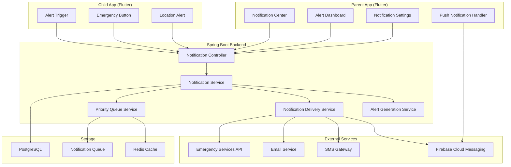
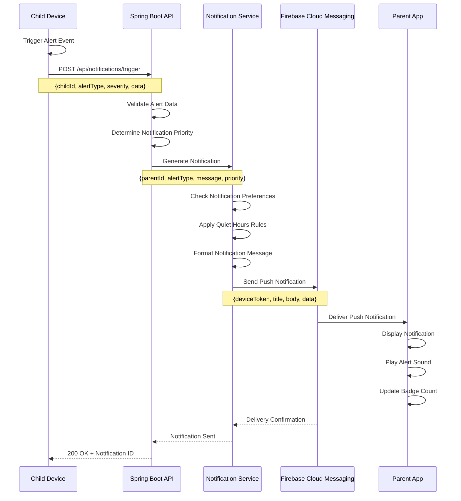
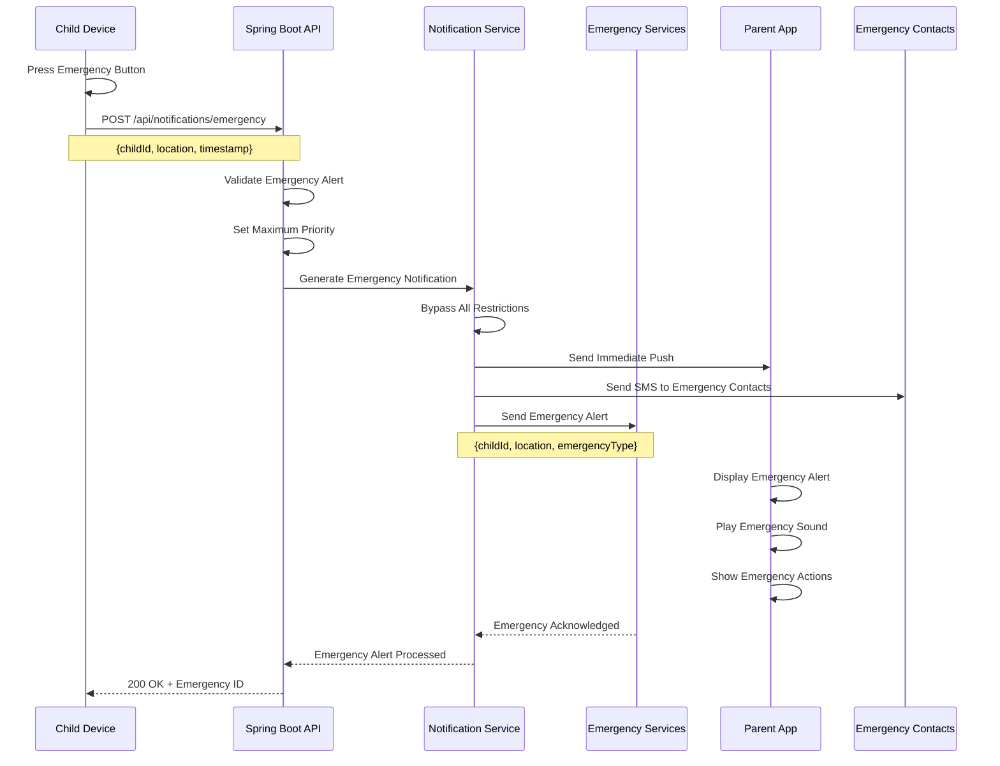
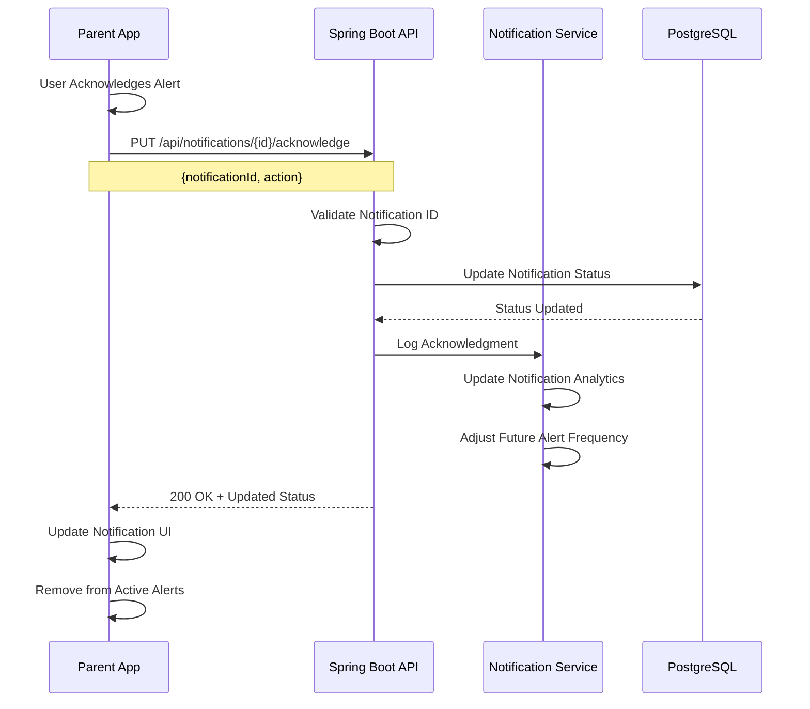

# Feature 06: Notifications & Alerts

## Overview
This feature provides comprehensive notification and alert management for the SafeGuard Parent App. It handles real-time notifications, alert prioritization, notification preferences, and multi-channel delivery (push, SMS, email).

## Table of Contents
1. [Feature Requirements](#feature-requirements)
2. [System Architecture](#system-architecture)
3. [Sequence Diagrams](#sequence-diagrams)
4. [API Specifications](#api-specifications)
5. [Database Design](#database-design)
6. [Frontend Implementation](#frontend-implementation)
7. [Backend Implementation](#backend-implementation)

---

## Feature Requirements

### Functional Requirements
- **FR-01**: System can send real-time push notifications
- **FR-02**: Parents can receive SMS alerts for critical events
- **FR-03**: System can send email notifications with detailed information
- **FR-04**: Parents can configure notification preferences per child
- **FR-05**: System supports different alert priority levels
- **FR-06**: Parents can set quiet hours for notifications
- **FR-07**: System can group related notifications
- **FR-08**: Parents can acknowledge and dismiss alerts
- **FR-09**: System provides notification history and analytics
- **FR-10**: System supports emergency alert escalation

### Non-Functional Requirements
- **NFR-01**: Push notification delivery time < 5 seconds
- **NFR-02**: SMS delivery time < 30 seconds
- **NFR-03**: Email delivery time < 2 minutes
- **NFR-04**: System supports 10,000+ concurrent notifications
- **NFR-05**: 99.9% notification delivery success rate
- **NFR-06**: Notification data encrypted in transit and at rest

---

## System Architecture

### Component Diagram


---

## Sequence Diagrams

### Push Notification Flow


### Emergency Alert Escalation Flow


### Notification Acknowledgment Flow


---

## API Specifications

### Endpoints Table
| Method | Endpoint | Description | Request Body | Response | Status Codes | Auth Required |
|--------|----------|-------------|--------------|----------|--------------|---------------|
| GET | `/api/notifications` | Get notifications | Query params | `List<NotificationResponse>` | 200, 401 | Yes |
| POST | `/api/notifications/trigger` | Trigger notification | `NotificationTriggerRequest` | `NotificationResponse` | 201, 400, 401 | Yes |
| PUT | `/api/notifications/{id}/acknowledge` | Acknowledge notification | `AcknowledgeRequest` | `MessageResponse` | 200, 404, 401 | Yes |
| PUT | `/api/notifications/{id}/dismiss` | Dismiss notification | None | `MessageResponse` | 200, 404, 401 | Yes |
| GET | `/api/notifications/settings` | Get notification settings | None | `NotificationSettingsResponse` | 200, 401 | Yes |
| PUT | `/api/notifications/settings` | Update notification settings | `NotificationSettingsRequest` | `MessageResponse` | 200, 400, 401 | Yes |
| POST | `/api/notifications/emergency` | Send emergency alert | `EmergencyAlertRequest` | `EmergencyAlertResponse` | 201, 400, 401 | Yes |
| GET | `/api/notifications/analytics` | Get notification analytics | Query params | `NotificationAnalyticsResponse` | 200, 401 | Yes |

### Request/Response Models

#### NotificationTriggerRequest
```json
{
  "childId": "string",
  "alertType": "LOCATION | GEOFENCE | AI | EMERGENCY | GENERAL",
  "severity": "LOW | MEDIUM | HIGH | CRITICAL",
  "title": "string",
  "message": "string",
  "data": {
    "location": {
      "latitude": "number",
      "longitude": "number",
      "address": "string"
    },
    "geofenceId": "string",
    "aiAnalysisId": "string",
    "customData": "object"
  },
  "channels": ["PUSH", "SMS", "EMAIL"],
  "priority": "LOW | NORMAL | HIGH | URGENT"
}
```

#### NotificationResponse
```json
{
  "id": "string",
  "childId": "string",
  "alertType": "string",
  "severity": "string",
  "title": "string",
  "message": "string",
  "data": "object",
  "channels": ["string"],
  "priority": "string",
  "isAcknowledged": "boolean",
  "isDismissed": "boolean",
  "deliveryStatus": {
    "push": "SENT | DELIVERED | FAILED",
    "sms": "SENT | DELIVERED | FAILED",
    "email": "SENT | DELIVERED | FAILED"
  },
  "createdAt": "datetime",
  "acknowledgedAt": "datetime",
  "dismissedAt": "datetime"
}
```

#### NotificationSettingsResponse
```json
{
  "childId": "string",
  "pushNotifications": {
    "enabled": "boolean",
    "alertTypes": ["string"],
    "severityLevels": ["string"]
  },
  "smsNotifications": {
    "enabled": "boolean",
    "phoneNumber": "string",
    "alertTypes": ["string"],
    "severityLevels": ["string"]
  },
  "emailNotifications": {
    "enabled": "boolean",
    "emailAddress": "string",
    "alertTypes": ["string"],
    "severityLevels": ["string"]
  },
  "quietHours": {
    "enabled": "boolean",
    "startTime": "string",
    "endTime": "string",
    "daysOfWeek": ["string"]
  },
  "emergencySettings": {
    "escalationEnabled": "boolean",
    "escalationDelay": "number",
    "emergencyContacts": ["string"]
  }
}
```

---

## Database Design

### Notifications Table
```sql
CREATE TABLE notifications (
    id BIGSERIAL PRIMARY KEY,
    child_id BIGINT NOT NULL REFERENCES children(id) ON DELETE CASCADE,
    alert_type VARCHAR(20) NOT NULL,
    severity VARCHAR(10) NOT NULL,
    title VARCHAR(255) NOT NULL,
    message TEXT NOT NULL,
    data JSONB,
    channels JSONB NOT NULL,
    priority VARCHAR(10) NOT NULL,
    is_acknowledged BOOLEAN NOT NULL DEFAULT false,
    is_dismissed BOOLEAN NOT NULL DEFAULT false,
    delivery_status JSONB,
    created_at TIMESTAMP NOT NULL DEFAULT CURRENT_TIMESTAMP,
    acknowledged_at TIMESTAMP,
    dismissed_at TIMESTAMP
);

CREATE INDEX idx_notifications_child_id ON notifications(child_id);
CREATE INDEX idx_notifications_alert_type ON notifications(alert_type);
CREATE INDEX idx_notifications_severity ON notifications(severity);
CREATE INDEX idx_notifications_created_at ON notifications(created_at);
CREATE INDEX idx_notifications_acknowledged ON notifications(is_acknowledged);
```

### Notification Settings Table
```sql
CREATE TABLE notification_settings (
    id BIGSERIAL PRIMARY KEY,
    child_id BIGINT NOT NULL REFERENCES children(id) ON DELETE CASCADE,
    push_enabled BOOLEAN NOT NULL DEFAULT true,
    push_alert_types JSONB,
    push_severity_levels JSONB,
    sms_enabled BOOLEAN NOT NULL DEFAULT false,
    sms_phone_number VARCHAR(20),
    sms_alert_types JSONB,
    sms_severity_levels JSONB,
    email_enabled BOOLEAN NOT NULL DEFAULT true,
    email_address VARCHAR(255),
    email_alert_types JSONB,
    email_severity_levels JSONB,
    quiet_hours_enabled BOOLEAN NOT NULL DEFAULT false,
    quiet_hours_start TIME,
    quiet_hours_end TIME,
    quiet_hours_days JSONB,
    escalation_enabled BOOLEAN NOT NULL DEFAULT true,
    escalation_delay_minutes INTEGER NOT NULL DEFAULT 5,
    emergency_contacts JSONB,
    created_at TIMESTAMP NOT NULL DEFAULT CURRENT_TIMESTAMP,
    updated_at TIMESTAMP NOT NULL DEFAULT CURRENT_TIMESTAMP
);

CREATE UNIQUE INDEX idx_notification_settings_child_id ON notification_settings(child_id);
```

### Notification Delivery Log Table
```sql
CREATE TABLE notification_delivery_log (
    id BIGSERIAL PRIMARY KEY,
    notification_id BIGINT NOT NULL REFERENCES notifications(id) ON DELETE CASCADE,
    channel VARCHAR(10) NOT NULL,
    recipient VARCHAR(255) NOT NULL,
    status VARCHAR(20) NOT NULL,
    error_message TEXT,
    delivered_at TIMESTAMP,
    created_at TIMESTAMP NOT NULL DEFAULT CURRENT_TIMESTAMP
);

CREATE INDEX idx_notification_delivery_log_notification_id ON notification_delivery_log(notification_id);
CREATE INDEX idx_notification_delivery_log_channel ON notification_delivery_log(channel);
CREATE INDEX idx_notification_delivery_log_status ON notification_delivery_log(status);
```

---

## Frontend Implementation (Flutter)

### Project Structure
```
lib/features/notifications/
├── data/
│   ├── datasources/
│   │   ├── notification_local_datasource.dart
│   │   └── notification_remote_datasource.dart
│   ├── models/
│   │   ├── notification_model.dart
│   │   └── notification_settings_model.dart
│   └── repositories/
│       └── notification_repository_impl.dart
├── domain/
│   ├── entities/
│   │   ├── notification.dart
│   │   └── notification_settings.dart
│   ├── repositories/
│   │   └── notification_repository.dart
│   └── usecases/
│       ├── get_notifications_usecase.dart
│       ├── acknowledge_notification_usecase.dart
│       └── update_settings_usecase.dart
└── presentation/
    ├── pages/
    │   ├── notification_center_page.dart
    │   ├── alert_dashboard_page.dart
    │   └── notification_settings_page.dart
    ├── widgets/
    │   ├── notification_card.dart
    │   ├── alert_badge.dart
    │   └── notification_settings_form.dart
    └── providers/
        └── notification_provider.dart
```

### Key Dependencies
```yaml
dependencies:
  # Push notifications
  firebase_messaging: ^14.7.10
  flutter_local_notifications: ^16.3.0
  
  # State management
  flutter_riverpod: ^2.4.0
  
  # UI components
  flutter_form_builder: ^9.1.1
  form_builder_validators: ^9.1.0
  
  # HTTP client
  dio: ^5.3.2
```

### Core Implementation

#### Notification Provider (Riverpod)
```dart
class NotificationNotifier extends StateNotifier<NotificationState> {
  final GetNotificationsUsecase _getNotificationsUsecase;
  final AcknowledgeNotificationUsecase _acknowledgeNotificationUsecase;
  final UpdateSettingsUsecase _updateSettingsUsecase;
  final FirebaseMessaging _firebaseMessaging;

  NotificationNotifier(
    this._getNotificationsUsecase,
    this._acknowledgeNotificationUsecase,
    this._updateSettingsUsecase,
  ) : super(NotificationInitial()) {
    _initializeFirebaseMessaging();
  }

  void _initializeFirebaseMessaging() {
    _firebaseMessaging = FirebaseMessaging.instance;
    
    // Request permission
    _firebaseMessaging.requestPermission(
      alert: true,
      badge: true,
      sound: true,
    );
    
    // Listen to foreground messages
    FirebaseMessaging.onMessage.listen((RemoteMessage message) {
      _handleForegroundMessage(message);
    });
    
    // Listen to background messages
    FirebaseMessaging.onMessageOpenedApp.listen((RemoteMessage message) {
      _handleBackgroundMessage(message);
    });
  }

  void _handleForegroundMessage(RemoteMessage message) {
    final notification = Notification.fromFirebaseMessage(message);
    
    if (state is NotificationLoaded) {
      final currentState = state as NotificationLoaded;
      final updatedNotifications = List<Notification>.from(currentState.notifications);
      updatedNotifications.insert(0, notification);
      
      state = NotificationLoaded(
        notifications: updatedNotifications,
        settings: currentState.settings,
        unreadCount: currentState.unreadCount + 1,
      );
    }
  }

  void _handleBackgroundMessage(RemoteMessage message) {
    // Handle background message
    final notification = Notification.fromFirebaseMessage(message);
    _addNotification(notification);
  }

  Future<void> getNotifications(String childId) async {
    state = NotificationLoading();
    
    final result = await _getNotificationsUsecase(GetNotificationsParams(childId: childId));

    result.fold(
      (failure) => state = NotificationError(failure.message),
      (notifications) => state = NotificationLoaded(
        notifications: notifications,
        settings: null,
        unreadCount: notifications.where((n) => !n.isAcknowledged).length,
      ),
    );
  }

  Future<void> acknowledgeNotification(String notificationId) async {
    state = NotificationLoading();
    
    final result = await _acknowledgeNotificationUsecase(
        AcknowledgeNotificationParams(notificationId: notificationId));

    result.fold(
      (failure) => state = NotificationError(failure.message),
      (_) => _refreshNotifications(),
    );
  }

  Future<void> updateSettings(NotificationSettings settings) async {
    state = NotificationLoading();
    
    final result = await _updateSettingsUsecase(UpdateSettingsParams(settings: settings));

    result.fold(
      (failure) => state = NotificationError(failure.message),
      (updatedSettings) {
        if (state is NotificationLoaded) {
          final currentState = state as NotificationLoaded;
          state = NotificationLoaded(
            notifications: currentState.notifications,
            settings: updatedSettings,
            unreadCount: currentState.unreadCount,
          );
        }
      },
    );
  }

  void _addNotification(Notification notification) {
    if (state is NotificationLoaded) {
      final currentState = state as NotificationLoaded;
      final updatedNotifications = List<Notification>.from(currentState.notifications);
      updatedNotifications.insert(0, notification);
      
      state = NotificationLoaded(
        notifications: updatedNotifications,
        settings: currentState.settings,
        unreadCount: currentState.unreadCount + 1,
      );
    }
  }

  Future<void> _refreshNotifications() async {
    // Refresh notifications logic
  }
}
```

#### Notification Center Widget
```dart
class NotificationCenterWidget extends ConsumerWidget {
  final String childId;

  const NotificationCenterWidget({
    Key? key,
    required this.childId,
  }) : super(key: key);

  @override
  Widget build(BuildContext context, WidgetRef ref) {
    final notificationState = ref.watch(notificationProvider);

    return Scaffold(
      appBar: AppBar(
        title: const Text('Notifications'),
        actions: [
          IconButton(
            icon: const Icon(Icons.settings),
            onPressed: () => _openSettings(context),
          ),
        ],
      ),
      body: _buildBody(notificationState),
    );
  }

  Widget _buildBody(NotificationState state) {
    if (state is NotificationLoading) {
      return const Center(child: CircularProgressIndicator());
    }
    
    if (state is NotificationError) {
      return Center(
        child: Column(
          mainAxisAlignment: MainAxisAlignment.center,
          children: [
            Icon(Icons.error, size: 64, color: Colors.red.shade300),
            const SizedBox(height: 16),
            Text(
              'Error loading notifications',
              style: Theme.of(context).textTheme.headlineSmall,
            ),
            const SizedBox(height: 8),
            Text(
              state.message,
              style: Theme.of(context).textTheme.bodyMedium,
              textAlign: TextAlign.center,
            ),
            const SizedBox(height: 16),
            ElevatedButton(
              onPressed: () => ref.read(notificationProvider.notifier).getNotifications(childId),
              child: const Text('Retry'),
            ),
          ],
        ),
      );
    }
    
    if (state is NotificationLoaded) {
      return Column(
        children: [
          // Unread count badge
          if (state.unreadCount > 0)
            Container(
              width: double.infinity,
              padding: const EdgeInsets.all(16),
              color: Colors.blue.shade50,
              child: Text(
                '${state.unreadCount} unread notifications',
                style: Theme.of(context).textTheme.bodyLarge?.copyWith(
                  color: Colors.blue.shade700,
                  fontWeight: FontWeight.w500,
                ),
              ),
            ),
          
          // Notifications list
          Expanded(
            child: state.notifications.isEmpty
                ? _buildEmptyState()
                : ListView.builder(
                    itemCount: state.notifications.length,
                    itemBuilder: (context, index) {
                      final notification = state.notifications[index];
                      return NotificationCard(
                        notification: notification,
                        onAcknowledge: () => _acknowledgeNotification(notification.id),
                        onDismiss: () => _dismissNotification(notification.id),
                      );
                    },
                  ),
          ),
        ],
      );
    }
    
    return const SizedBox.shrink();
  }

  Widget _buildEmptyState() {
    return Center(
      child: Column(
        mainAxisAlignment: MainAxisAlignment.center,
        children: [
          Icon(
            Icons.notifications_none,
            size: 64,
            color: Colors.grey.shade400,
          ),
          const SizedBox(height: 16),
          Text(
            'No notifications yet',
            style: Theme.of(context).textTheme.headlineSmall?.copyWith(
              color: Colors.grey.shade600,
            ),
          ),
          const SizedBox(height: 8),
          Text(
            'You\'ll receive notifications here when there are alerts for your child.',
            style: Theme.of(context).textTheme.bodyMedium?.copyWith(
              color: Colors.grey.shade500,
            ),
            textAlign: TextAlign.center,
          ),
        ],
      ),
    );
  }

  void _acknowledgeNotification(String notificationId) {
    ref.read(notificationProvider.notifier).acknowledgeNotification(notificationId);
  }

  void _dismissNotification(String notificationId) {
    // Implement dismiss notification
  }

  void _openSettings(BuildContext context) {
    Navigator.push(
      context,
      MaterialPageRoute(
        builder: (context) => NotificationSettingsPage(childId: childId),
      ),
    );
  }
}
```

#### Notification Card Widget
```dart
class NotificationCard extends StatelessWidget {
  final Notification notification;
  final VoidCallback onAcknowledge;
  final VoidCallback onDismiss;

  const NotificationCard({
    Key? key,
    required this.notification,
    required this.onAcknowledge,
    required this.onDismiss,
  }) : super(key: key);

  @override
  Widget build(BuildContext context) {
    return Card(
      margin: const EdgeInsets.symmetric(horizontal: 16, vertical: 4),
      child: ListTile(
        leading: _buildNotificationIcon(),
        title: Text(
          notification.title,
          style: TextStyle(
            fontWeight: notification.isAcknowledged ? FontWeight.normal : FontWeight.bold,
          ),
        ),
        subtitle: Column(
          crossAxisAlignment: CrossAxisAlignment.start,
          children: [
            Text(notification.message),
            const SizedBox(height: 4),
            Row(
              children: [
                _buildSeverityChip(),
                const SizedBox(width: 8),
                _buildTypeChip(),
                const Spacer(),
                Text(
                  _formatTimestamp(notification.createdAt),
                  style: Theme.of(context).textTheme.bodySmall,
                ),
              ],
            ),
          ],
        ),
        trailing: _buildActionButtons(),
        onTap: notification.isAcknowledged ? null : onAcknowledge,
      ),
    );
  }

  Widget _buildNotificationIcon() {
    IconData iconData;
    Color iconColor;
    
    switch (notification.alertType) {
      case 'LOCATION':
        iconData = Icons.location_on;
        iconColor = Colors.blue;
        break;
      case 'GEOFENCE':
        iconData = Icons.fence;
        iconColor = Colors.orange;
        break;
      case 'AI':
        iconData = Icons.psychology;
        iconColor = Colors.purple;
        break;
      case 'EMERGENCY':
        iconData = Icons.warning;
        iconColor = Colors.red;
        break;
      default:
        iconData = Icons.notifications;
        iconColor = Colors.grey;
    }
    
    return CircleAvatar(
      backgroundColor: iconColor.withOpacity(0.1),
      child: Icon(iconData, color: iconColor),
    );
  }

  Widget _buildSeverityChip() {
    Color chipColor;
    switch (notification.severity) {
      case 'CRITICAL':
        chipColor = Colors.red;
        break;
      case 'HIGH':
        chipColor = Colors.orange;
        break;
      case 'MEDIUM':
        chipColor = Colors.yellow;
        break;
      case 'LOW':
        chipColor = Colors.green;
        break;
      default:
        chipColor = Colors.grey;
    }
    
    return Chip(
      label: Text(
        notification.severity,
        style: const TextStyle(fontSize: 10, color: Colors.white),
      ),
      backgroundColor: chipColor,
      materialTapTargetSize: MaterialTapTargetSize.shrinkWrap,
    );
  }

  Widget _buildTypeChip() {
    return Chip(
      label: Text(
        notification.alertType,
        style: const TextStyle(fontSize: 10),
      ),
      backgroundColor: Colors.grey.shade200,
      materialTapTargetSize: MaterialTapTargetSize.shrinkWrap,
    );
  }

  Widget _buildActionButtons() {
    if (notification.isAcknowledged) {
      return const Icon(Icons.check_circle, color: Colors.green);
    }
    
    return Row(
      mainAxisSize: MainAxisSize.min,
      children: [
        IconButton(
          icon: const Icon(Icons.check),
          onPressed: onAcknowledge,
          tooltip: 'Acknowledge',
        ),
        IconButton(
          icon: const Icon(Icons.close),
          onPressed: onDismiss,
          tooltip: 'Dismiss',
        ),
      ],
    );
  }

  String _formatTimestamp(DateTime timestamp) {
    final now = DateTime.now();
    final difference = now.difference(timestamp);
    
    if (difference.inMinutes < 1) {
      return 'Just now';
    } else if (difference.inHours < 1) {
      return '${difference.inMinutes}m ago';
    } else if (difference.inDays < 1) {
      return '${difference.inHours}h ago';
    } else {
      return '${difference.inDays}d ago';
    }
  }
}
```

---

## Backend Implementation (Spring Boot)

### Project Structure
```
src/main/java/com/safeguard/parentapp/notifications/
├── controller/
│   └── NotificationController.java
├── dto/
│   ├── request/
│   │   ├── NotificationTriggerRequest.java
│   │   └── NotificationSettingsRequest.java
│   └── response/
│       ├── NotificationResponse.java
│       └── NotificationSettingsResponse.java
├── entity/
│   ├── Notification.java
│   ├── NotificationSettings.java
│   └── NotificationDeliveryLog.java
├── repository/
│   ├── NotificationRepository.java
│   ├── NotificationSettingsRepository.java
│   └── NotificationDeliveryLogRepository.java
├── service/
│   ├── NotificationService.java
│   ├── PushNotificationService.java
│   ├── SmsNotificationService.java
│   ├── EmailNotificationService.java
│   └── EmergencyAlertService.java
└── config/
    └── FirebaseConfig.java
```

### Core Implementation

#### Notification Service
```java
@Service
@RequiredArgsConstructor
@Transactional
public class NotificationService {
    
    private final NotificationRepository notificationRepository;
    private final NotificationSettingsRepository settingsRepository;
    private final NotificationDeliveryLogRepository deliveryLogRepository;
    private final PushNotificationService pushNotificationService;
    private final SmsNotificationService smsNotificationService;
    private final EmailNotificationService emailNotificationService;
    private final EmergencyAlertService emergencyAlertService;
    private final JwtService jwtService;
    
    public NotificationResponse triggerNotification(NotificationTriggerRequest request, String token) {
        Long parentId = jwtService.getUserIdFromToken(token);
        
        // Verify child belongs to parent
        if (!isChildOwnedByParent(request.getChildId(), parentId)) {
            throw new RuntimeException("Child not found or access denied");
        }
        
        // Get notification settings
        NotificationSettings settings = settingsRepository
                .findByChildId(request.getChildId())
                .orElse(getDefaultSettings(request.getChildId()));
        
        // Check if notification should be sent
        if (!_shouldSendNotification(request, settings)) {
            throw new RuntimeException("Notification blocked by settings");
        }
        
        // Create notification
        Notification notification = Notification.builder()
                .childId(request.getChildId())
                .alertType(request.getAlertType())
                .severity(request.getSeverity())
                .title(request.getTitle())
                .message(request.getMessage())
                .data(request.getData())
                .channels(request.getChannels())
                .priority(request.getPriority())
                .isAcknowledged(false)
                .isDismissed(false)
                .build();
        
        Notification savedNotification = notificationRepository.save(notification);
        
        // Send notifications through configured channels
        Map<String, String> deliveryStatus = new HashMap<>();
        
        for (String channel : request.getChannels()) {
            try {
                switch (channel) {
                    case "PUSH":
                        if (settings.getPushEnabled()) {
                            pushNotificationService.sendPushNotification(savedNotification, parentId);
                            deliveryStatus.put("push", "SENT");
                        }
                        break;
                    case "SMS":
                        if (settings.getSmsEnabled()) {
                            smsNotificationService.sendSmsNotification(savedNotification, settings.getSmsPhoneNumber());
                            deliveryStatus.put("sms", "SENT");
                        }
                        break;
                    case "EMAIL":
                        if (settings.getEmailEnabled()) {
                            emailNotificationService.sendEmailNotification(savedNotification, settings.getEmailAddress());
                            deliveryStatus.put("email", "SENT");
                        }
                        break;
                }
            } catch (Exception e) {
                deliveryStatus.put(channel.toLowerCase(), "FAILED");
                log.error("Failed to send {} notification: {}", channel, e.getMessage());
            }
        }
        
        // Update delivery status
        savedNotification.setDeliveryStatus(deliveryStatus);
        notificationRepository.save(savedNotification);
        
        return mapToNotificationResponse(savedNotification);
    }
    
    public MessageResponse acknowledgeNotification(Long notificationId, String token) {
        Long parentId = jwtService.getUserIdFromToken(token);
        
        Notification notification = notificationRepository.findById(notificationId)
                .orElseThrow(() -> new RuntimeException("Notification not found"));
        
        // Verify notification belongs to parent's child
        if (!isChildOwnedByParent(notification.getChildId(), parentId)) {
            throw new RuntimeException("Access denied");
        }
        
        // Update notification
        notification.setIsAcknowledged(true);
        notification.setAcknowledgedAt(LocalDateTime.now());
        notificationRepository.save(notification);
        
        return MessageResponse.builder()
                .success(true)
                .message("Notification acknowledged")
                .timestamp(LocalDateTime.now())
                .build();
    }
    
    public MessageResponse dismissNotification(Long notificationId, String token) {
        Long parentId = jwtService.getUserIdFromToken(token);
        
        Notification notification = notificationRepository.findById(notificationId)
                .orElseThrow(() -> new RuntimeException("Notification not found"));
        
        // Verify notification belongs to parent's child
        if (!isChildOwnedByParent(notification.getChildId(), parentId)) {
            throw new RuntimeException("Access denied");
        }
        
        // Update notification
        notification.setIsDismissed(true);
        notification.setDismissedAt(LocalDateTime.now());
        notificationRepository.save(notification);
        
        return MessageResponse.builder()
                .success(true)
                .message("Notification dismissed")
                .timestamp(LocalDateTime.now())
                .build();
    }
    
    public List<NotificationResponse> getNotifications(Long childId, String token) {
        Long parentId = jwtService.getUserIdFromToken(token);
        
        if (!isChildOwnedByParent(childId, parentId)) {
            throw new RuntimeException("Access denied");
        }
        
        List<Notification> notifications = notificationRepository
                .findByChildIdOrderByCreatedAtDesc(childId);
        
        return notifications.stream()
                .map(this::mapToNotificationResponse)
                .collect(Collectors.toList());
    }
    
    public NotificationSettingsResponse getNotificationSettings(Long childId, String token) {
        Long parentId = jwtService.getUserIdFromToken(token);
        
        if (!isChildOwnedByParent(childId, parentId)) {
            throw new RuntimeException("Access denied");
        }
        
        NotificationSettings settings = settingsRepository
                .findByChildId(childId)
                .orElse(getDefaultSettings(childId));
        
        return mapToNotificationSettingsResponse(settings);
    }
    
    public MessageResponse updateNotificationSettings(
            Long childId, NotificationSettingsRequest request, String token) {
        Long parentId = jwtService.getUserIdFromToken(token);
        
        if (!isChildOwnedByParent(childId, parentId)) {
            throw new RuntimeException("Access denied");
        }
        
        NotificationSettings settings = settingsRepository
                .findByChildId(childId)
                .orElse(NotificationSettings.builder().childId(childId).build());
        
        // Update settings
        settings.setPushEnabled(request.getPushNotifications().getEnabled());
        settings.setPushAlertTypes(request.getPushNotifications().getAlertTypes());
        settings.setPushSeverityLevels(request.getPushNotifications().getSeverityLevels());
        
        settings.setSmsEnabled(request.getSmsNotifications().getEnabled());
        settings.setSmsPhoneNumber(request.getSmsNotifications().getPhoneNumber());
        settings.setSmsAlertTypes(request.getSmsNotifications().getAlertTypes());
        settings.setSmsSeverityLevels(request.getSmsNotifications().getSeverityLevels());
        
        settings.setEmailEnabled(request.getEmailNotifications().getEnabled());
        settings.setEmailAddress(request.getEmailNotifications().getEmailAddress());
        settings.setEmailAlertTypes(request.getEmailNotifications().getAlertTypes());
        settings.setEmailSeverityLevels(request.getEmailNotifications().getSeverityLevels());
        
        settings.setQuietHoursEnabled(request.getQuietHours().getEnabled());
        settings.setQuietHoursStart(request.getQuietHours().getStartTime());
        settings.setQuietHoursEnd(request.getQuietHours().getEndTime());
        settings.setQuietHoursDays(request.getQuietHours().getDaysOfWeek());
        
        settings.setEscalationEnabled(request.getEmergencySettings().getEscalationEnabled());
        settings.setEscalationDelayMinutes(request.getEmergencySettings().getEscalationDelay());
        settings.setEmergencyContacts(request.getEmergencySettings().getEmergencyContacts());
        
        settingsRepository.save(settings);
        
        return MessageResponse.builder()
                .success(true)
                .message("Notification settings updated")
                .timestamp(LocalDateTime.now())
                .build();
    }
    
    public EmergencyAlertResponse sendEmergencyAlert(EmergencyAlertRequest request, String token) {
        Long parentId = jwtService.getUserIdFromToken(token);
        
        if (!isChildOwnedByParent(request.getChildId(), parentId)) {
            throw new RuntimeException("Access denied");
        }
        
        // Create emergency notification
        NotificationTriggerRequest emergencyRequest = NotificationTriggerRequest.builder()
                .childId(request.getChildId())
                .alertType("EMERGENCY")
                .severity("CRITICAL")
                .title("EMERGENCY ALERT")
                .message("Emergency button pressed by child")
                .data(request.getData())
                .channels(Arrays.asList("PUSH", "SMS", "EMAIL"))
                .priority("URGENT")
                .build();
        
        NotificationResponse notification = triggerNotification(emergencyRequest, token);
        
        // Send emergency alert to emergency services
        emergencyAlertService.sendEmergencyAlert(request);
        
        return EmergencyAlertResponse.builder()
                .success(true)
                .message("Emergency alert sent")
                .notificationId(notification.getId())
                .timestamp(LocalDateTime.now())
                .build();
    }
    
    private boolean _shouldSendNotification(NotificationTriggerRequest request, NotificationSettings settings) {
        // Check quiet hours
        if (settings.getQuietHoursEnabled() && _isWithinQuietHours(settings)) {
            return false;
        }
        
        // Check channel-specific settings
        for (String channel : request.getChannels()) {
            switch (channel) {
                case "PUSH":
                    if (!settings.getPushEnabled()) return false;
                    if (!_isAlertTypeAllowed(request.getAlertType(), settings.getPushAlertTypes())) return false;
                    if (!_isSeverityAllowed(request.getSeverity(), settings.getPushSeverityLevels())) return false;
                    break;
                case "SMS":
                    if (!settings.getSmsEnabled()) return false;
                    if (!_isAlertTypeAllowed(request.getAlertType(), settings.getSmsAlertTypes())) return false;
                    if (!_isSeverityAllowed(request.getSeverity(), settings.getSmsSeverityLevels())) return false;
                    break;
                case "EMAIL":
                    if (!settings.getEmailEnabled()) return false;
                    if (!_isAlertTypeAllowed(request.getAlertType(), settings.getEmailAlertTypes())) return false;
                    if (!_isSeverityAllowed(request.getSeverity(), settings.getEmailSeverityLevels())) return false;
                    break;
            }
        }
        
        return true;
    }
    
    private boolean _isWithinQuietHours(NotificationSettings settings) {
        LocalTime now = LocalTime.now();
        LocalTime startTime = settings.getQuietHoursStart();
        LocalTime endTime = settings.getQuietHoursEnd();
        
        if (startTime == null || endTime == null) return false;
        
        if (startTime.isBefore(endTime)) {
            return now.isAfter(startTime) && now.isBefore(endTime);
        } else {
            return now.isAfter(startTime) || now.isBefore(endTime);
        }
    }
    
    private boolean _isAlertTypeAllowed(String alertType, List<String> allowedTypes) {
        return allowedTypes == null || allowedTypes.contains(alertType);
    }
    
    private boolean _isSeverityAllowed(String severity, List<String> allowedSeverities) {
        return allowedSeverities == null || allowedSeverities.contains(severity);
    }
    
    private NotificationSettings getDefaultSettings(Long childId) {
        return NotificationSettings.builder()
                .childId(childId)
                .pushEnabled(true)
                .pushAlertTypes(Arrays.asList("LOCATION", "GEOFENCE", "AI", "EMERGENCY"))
                .pushSeverityLevels(Arrays.asList("MEDIUM", "HIGH", "CRITICAL"))
                .smsEnabled(false)
                .emailEnabled(true)
                .emailAlertTypes(Arrays.asList("EMERGENCY"))
                .emailSeverityLevels(Arrays.asList("HIGH", "CRITICAL"))
                .quietHoursEnabled(false)
                .escalationEnabled(true)
                .escalationDelayMinutes(5)
                .build();
    }
    
    private boolean isChildOwnedByParent(Long childId, Long parentId) {
        // Implementation to check if child belongs to parent
        return true; // Placeholder
    }
    
    private NotificationResponse mapToNotificationResponse(Notification notification) {
        return NotificationResponse.builder()
                .id(notification.getId())
                .childId(notification.getChildId())
                .alertType(notification.getAlertType())
                .severity(notification.getSeverity())
                .title(notification.getTitle())
                .message(notification.getMessage())
                .data(notification.getData())
                .channels(notification.getChannels())
                .priority(notification.getPriority())
                .isAcknowledged(notification.getIsAcknowledged())
                .isDismissed(notification.getIsDismissed())
                .deliveryStatus(notification.getDeliveryStatus())
                .createdAt(notification.getCreatedAt())
                .acknowledgedAt(notification.getAcknowledgedAt())
                .dismissedAt(notification.getDismissedAt())
                .build();
    }
    
    private NotificationSettingsResponse mapToNotificationSettingsResponse(NotificationSettings settings) {
        return NotificationSettingsResponse.builder()
                .childId(settings.getChildId())
                .pushNotifications(PushNotifications.builder()
                        .enabled(settings.getPushEnabled())
                        .alertTypes(settings.getPushAlertTypes())
                        .severityLevels(settings.getPushSeverityLevels())
                        .build())
                .smsNotifications(SmsNotifications.builder()
                        .enabled(settings.getSmsEnabled())
                        .phoneNumber(settings.getSmsPhoneNumber())
                        .alertTypes(settings.getSmsAlertTypes())
                        .severityLevels(settings.getSmsSeverityLevels())
                        .build())
                .emailNotifications(EmailNotifications.builder()
                        .enabled(settings.getEmailEnabled())
                        .emailAddress(settings.getEmailAddress())
                        .alertTypes(settings.getEmailAlertTypes())
                        .severityLevels(settings.getEmailSeverityLevels())
                        .build())
                .quietHours(QuietHours.builder()
                        .enabled(settings.getQuietHoursEnabled())
                        .startTime(settings.getQuietHoursStart())
                        .endTime(settings.getQuietHoursEnd())
                        .daysOfWeek(settings.getQuietHoursDays())
                        .build())
                .emergencySettings(EmergencySettings.builder()
                        .escalationEnabled(settings.getEscalationEnabled())
                        .escalationDelay(settings.getEscalationDelayMinutes())
                        .emergencyContacts(settings.getEmergencyContacts())
                        .build())
                .build();
    }
}
```

---

## Security Considerations

### Notification Security
- **Data Encryption**: Notification data encrypted in transit and at rest
- **Access Control**: Parents can only access their children's notifications
- **Rate Limiting**: Prevent notification spam and abuse
- **Audit Logging**: Track all notification activities

### Privacy Compliance
- **Data Minimization**: Only necessary data included in notifications
- **Consent Management**: Clear consent for notification channels
- **Right to Delete**: Parents can delete notification history
- **Transparency**: Clear information about notification usage

---

## Testing Strategy

### Unit Tests
- **Service Layer**: Test notification business logic
- **Delivery Services**: Test push, SMS, and email delivery
- **Settings Management**: Test notification preferences

### Integration Tests
- **API Endpoints**: Test notification CRUD operations
- **External Services**: Test integration with FCM, SMS, and email
- **Database**: Test notification data persistence

### Performance Tests
- **Delivery Speed**: Test notification delivery times
- **Concurrent Notifications**: Test high-volume notification handling
- **Queue Processing**: Test notification queue performance

This comprehensive feature documentation provides everything needed to implement the Notifications & Alerts feature for the SafeGuard Parent App.
