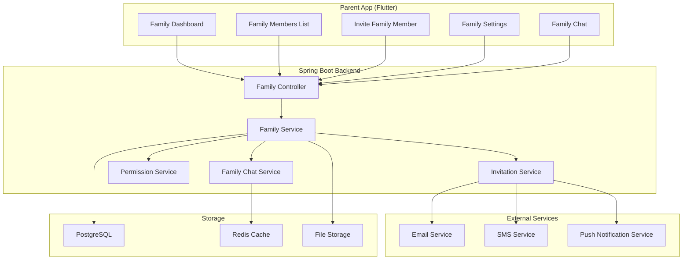
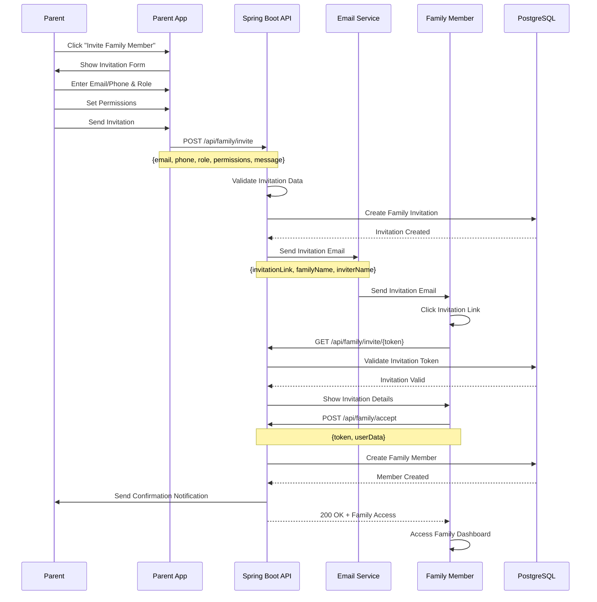
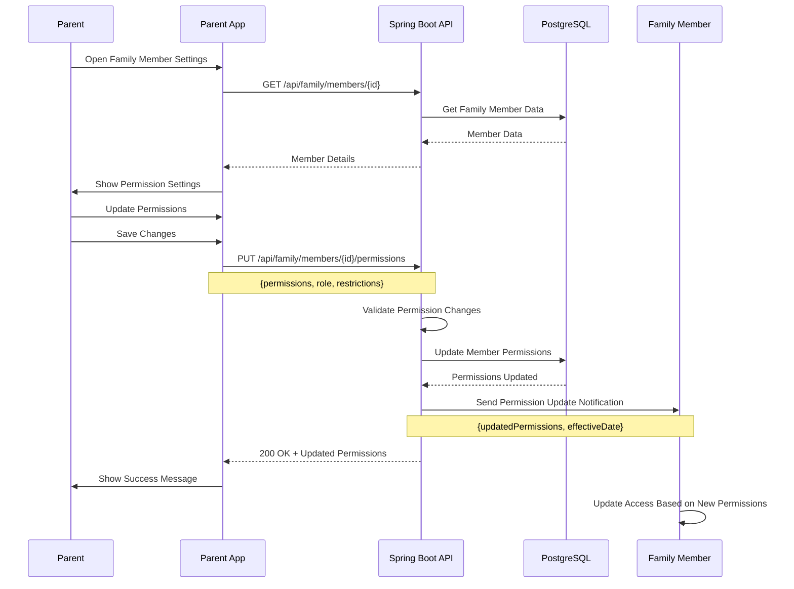
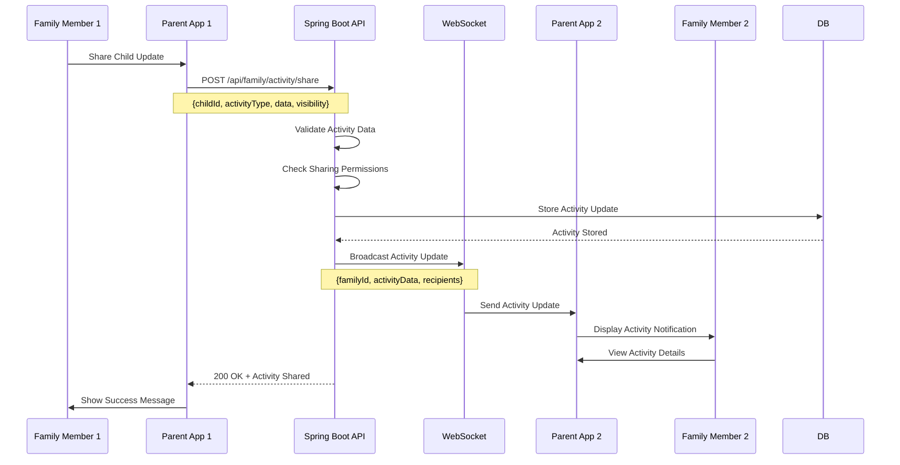

# Feature 07: Family Management

## Overview
This feature provides comprehensive family management capabilities for the SafeGuard Parent App. It handles family member management, role assignments, family group settings, and collaborative monitoring features.

## Table of Contents
1. [Feature Requirements](#feature-requirements)
2. [System Architecture](#system-architecture)
3. [Sequence Diagrams](#sequence-diagrams)
4. [API Specifications](#api-specifications)
5. [Database Design](#database-design)
6. [Frontend Implementation](#frontend-implementation)
7. [Backend Implementation](#backend-implementation)

---

## Feature Requirements

### Functional Requirements
- **FR-01**: Parents can create and manage family groups
- **FR-02**: Parents can invite family members to join the family
- **FR-03**: System supports different family member roles (Parent, Guardian, Grandparent)
- **FR-04**: Family members can view shared children's information
- **FR-05**: Parents can set permissions for each family member
- **FR-06**: System supports family group chat and communication
- **FR-07**: Family members can share location and status updates
- **FR-08**: Parents can manage family emergency contacts
- **FR-09**: System provides family activity dashboard
- **FR-10**: Family members can collaborate on child safety decisions

### Non-Functional Requirements
- **NFR-01**: Family invitation response time < 3 seconds
- **NFR-02**: System supports up to 20 family members per group
- **NFR-03**: Real-time family updates via WebSocket
- **NFR-04**: Family data encrypted and access-controlled
- **NFR-05**: 99.9% uptime for family management services
- **NFR-06**: System supports multiple family groups per user

---

## System Architecture

### Component Diagram


---

## Sequence Diagrams

### Family Member Invitation Flow


### Family Permission Management Flow


### Family Activity Sharing Flow


---

## API Specifications

### Endpoints Table
| Method | Endpoint | Description | Request Body | Response | Status Codes | Auth Required |
|--------|----------|-------------|--------------|----------|--------------|---------------|
| GET | `/api/family` | Get family information | None | `FamilyResponse` | 200, 401 | Yes |
| POST | `/api/family/invite` | Invite family member | `FamilyInviteRequest` | `MessageResponse` | 201, 400, 401 | Yes |
| GET | `/api/family/invite/{token}` | Get invitation details | None | `InvitationResponse` | 200, 404 | No |
| POST | `/api/family/accept` | Accept invitation | `AcceptInvitationRequest` | `MessageResponse` | 200, 400 | No |
| GET | `/api/family/members` | Get family members | None | `List<FamilyMemberResponse>` | 200, 401 | Yes |
| PUT | `/api/family/members/{id}` | Update family member | `UpdateMemberRequest` | `FamilyMemberResponse` | 200, 400, 404, 401 | Yes |
| DELETE | `/api/family/members/{id}` | Remove family member | None | `MessageResponse` | 200, 404, 401 | Yes |
| GET | `/api/family/activity` | Get family activity | Query params | `List<ActivityResponse>` | 200, 401 | Yes |
| POST | `/api/family/activity/share` | Share activity | `ShareActivityRequest` | `MessageResponse` | 201, 400, 401 | Yes |
| GET | `/api/family/settings` | Get family settings | None | `FamilySettingsResponse` | 200, 401 | Yes |
| PUT | `/api/family/settings` | Update family settings | `FamilySettingsRequest` | `MessageResponse` | 200, 400, 401 | Yes |

### Request/Response Models

#### FamilyInviteRequest
```json
{
  "email": "string",
  "phone": "string",
  "role": "PARENT | GUARDIAN | GRANDPARENT | SIBLING",
  "permissions": {
    "canViewLocation": "boolean",
    "canViewAlerts": "boolean",
    "canManageChildren": "boolean",
    "canInviteMembers": "boolean",
    "canModifySettings": "boolean"
  },
  "message": "string",
  "expiryDays": "number"
}
```

#### FamilyResponse
```json
{
  "id": "string",
  "name": "string",
  "description": "string",
  "createdBy": "string",
  "createdAt": "datetime",
  "members": [
    {
      "id": "string",
      "userId": "string",
      "name": "string",
      "email": "string",
      "phone": "string",
      "role": "string",
      "permissions": "object",
      "joinedAt": "datetime",
      "isActive": "boolean"
    }
  ],
  "settings": {
    "allowMemberInvites": "boolean",
    "requireApprovalForJoins": "boolean",
    "defaultPermissions": "object",
    "emergencyContacts": ["string"]
  }
}
```

#### FamilyMemberResponse
```json
{
  "id": "string",
  "userId": "string",
  "name": "string",
  "email": "string",
  "phone": "string",
  "role": "string",
  "permissions": {
    "canViewLocation": "boolean",
    "canViewAlerts": "boolean",
    "canManageChildren": "boolean",
    "canInviteMembers": "boolean",
    "canModifySettings": "boolean"
  },
  "joinedAt": "datetime",
  "lastActiveAt": "datetime",
  "isActive": "boolean",
  "profilePicture": "string"
}
```

---

## Database Design

### Families Table
```sql
CREATE TABLE families (
    id BIGSERIAL PRIMARY KEY,
    name VARCHAR(100) NOT NULL,
    description TEXT,
    created_by BIGINT NOT NULL REFERENCES users(id) ON DELETE CASCADE,
    family_code VARCHAR(20) UNIQUE NOT NULL,
    is_active BOOLEAN NOT NULL DEFAULT true,
    created_at TIMESTAMP NOT NULL DEFAULT CURRENT_TIMESTAMP,
    updated_at TIMESTAMP NOT NULL DEFAULT CURRENT_TIMESTAMP
);

CREATE INDEX idx_families_created_by ON families(created_by);
CREATE INDEX idx_families_family_code ON families(family_code);
CREATE INDEX idx_families_active ON families(is_active);
```

### Family Members Table
```sql
CREATE TABLE family_members (
    id BIGSERIAL PRIMARY KEY,
    family_id BIGINT NOT NULL REFERENCES families(id) ON DELETE CASCADE,
    user_id BIGINT NOT NULL REFERENCES users(id) ON DELETE CASCADE,
    role VARCHAR(20) NOT NULL CHECK (role IN ('PARENT', 'GUARDIAN', 'GRANDPARENT', 'SIBLING')),
    permissions JSONB NOT NULL,
    joined_at TIMESTAMP NOT NULL DEFAULT CURRENT_TIMESTAMP,
    last_active_at TIMESTAMP,
    is_active BOOLEAN NOT NULL DEFAULT true,
    invited_by BIGINT REFERENCES users(id),
    UNIQUE(family_id, user_id)
);

CREATE INDEX idx_family_members_family_id ON family_members(family_id);
CREATE INDEX idx_family_members_user_id ON family_members(user_id);
CREATE INDEX idx_family_members_role ON family_members(role);
CREATE INDEX idx_family_members_active ON family_members(is_active);
```

### Family Invitations Table
```sql
CREATE TABLE family_invitations (
    id BIGSERIAL PRIMARY KEY,
    family_id BIGINT NOT NULL REFERENCES families(id) ON DELETE CASCADE,
    email VARCHAR(255),
    phone VARCHAR(20),
    role VARCHAR(20) NOT NULL,
    permissions JSONB NOT NULL,
    invitation_token VARCHAR(255) UNIQUE NOT NULL,
    invited_by BIGINT NOT NULL REFERENCES users(id),
    message TEXT,
    expires_at TIMESTAMP NOT NULL,
    is_accepted BOOLEAN NOT NULL DEFAULT false,
    accepted_at TIMESTAMP,
    created_at TIMESTAMP NOT NULL DEFAULT CURRENT_TIMESTAMP
);

CREATE INDEX idx_family_invitations_family_id ON family_invitations(family_id);
CREATE INDEX idx_family_invitations_token ON family_invitations(invitation_token);
CREATE INDEX idx_family_invitations_email ON family_invitations(email);
CREATE INDEX idx_family_invitations_expires ON family_invitations(expires_at);
```

### Family Activity Table
```sql
CREATE TABLE family_activity (
    id BIGSERIAL PRIMARY KEY,
    family_id BIGINT NOT NULL REFERENCES families(id) ON DELETE CASCADE,
    user_id BIGINT NOT NULL REFERENCES users(id) ON DELETE CASCADE,
    child_id BIGINT REFERENCES children(id) ON DELETE CASCADE,
    activity_type VARCHAR(50) NOT NULL,
    title VARCHAR(255) NOT NULL,
    description TEXT,
    data JSONB,
    visibility VARCHAR(20) NOT NULL DEFAULT 'FAMILY',
    created_at TIMESTAMP NOT NULL DEFAULT CURRENT_TIMESTAMP
);

CREATE INDEX idx_family_activity_family_id ON family_activity(family_id);
CREATE INDEX idx_family_activity_user_id ON family_activity(user_id);
CREATE INDEX idx_family_activity_child_id ON family_activity(child_id);
CREATE INDEX idx_family_activity_type ON family_activity(activity_type);
CREATE INDEX idx_family_activity_created_at ON family_activity(created_at);
```

### Family Settings Table
```sql
CREATE TABLE family_settings (
    id BIGSERIAL PRIMARY KEY,
    family_id BIGINT NOT NULL REFERENCES families(id) ON DELETE CASCADE,
    allow_member_invites BOOLEAN NOT NULL DEFAULT true,
    require_approval_for_joins BOOLEAN NOT NULL DEFAULT false,
    default_permissions JSONB NOT NULL,
    emergency_contacts JSONB,
    notification_settings JSONB,
    created_at TIMESTAMP NOT NULL DEFAULT CURRENT_TIMESTAMP,
    updated_at TIMESTAMP NOT NULL DEFAULT CURRENT_TIMESTAMP
);

CREATE UNIQUE INDEX idx_family_settings_family_id ON family_settings(family_id);
```

---

## Frontend Implementation (Flutter)

### Project Structure
```
lib/features/family_management/
├── data/
│   ├── datasources/
│   │   ├── family_local_datasource.dart
│   │   └── family_remote_datasource.dart
│   ├── models/
│   │   ├── family_model.dart
│   │   ├── family_member_model.dart
│   │   └── family_invitation_model.dart
│   └── repositories/
│       └── family_repository_impl.dart
├── domain/
│   ├── entities/
│   │   ├── family.dart
│   │   ├── family_member.dart
│   │   └── family_invitation.dart
│   ├── repositories/
│   │   └── family_repository.dart
│   └── usecases/
│       ├── invite_family_member_usecase.dart
│       ├── update_member_permissions_usecase.dart
│       └── share_activity_usecase.dart
└── presentation/
    ├── pages/
    │   ├── family_dashboard_page.dart
    │   ├── family_members_page.dart
    │   ├── invite_member_page.dart
    │   └── family_settings_page.dart
    ├── widgets/
    │   ├── family_member_card.dart
    │   ├── permission_selector.dart
    │   └── activity_timeline.dart
    └── providers/
        └── family_provider.dart
```

### Key Dependencies
```yaml
dependencies:
  # State management
  flutter_riverpod: ^2.4.0
  
  # UI components
  flutter_form_builder: ^9.1.1
  form_builder_validators: ^9.1.0
  
  # HTTP client
  dio: ^5.3.2
  
  # WebSocket
  web_socket_channel: ^2.4.0
  
  # Image handling
  cached_network_image: ^3.3.0
```

### Core Implementation

#### Family Provider (Riverpod)
```dart
class FamilyNotifier extends StateNotifier<FamilyState> {
  final InviteFamilyMemberUsecase _inviteFamilyMemberUsecase;
  final UpdateMemberPermissionsUsecase _updateMemberPermissionsUsecase;
  final ShareActivityUsecase _shareActivityUsecase;
  final WebSocketChannel _webSocketChannel;

  FamilyNotifier(
    this._inviteFamilyMemberUsecase,
    this._updateMemberPermissionsUsecase,
    this._shareActivityUsecase,
  ) : super(FamilyInitial()) {
    _initializeWebSocket();
  }

  void _initializeWebSocket() {
    _webSocketChannel = WebSocketChannel.connect(
      Uri.parse('ws://your-api-domain.com/ws/family'),
    );

    _webSocketChannel.stream.listen((data) {
      final activityData = jsonDecode(data);
      _handleFamilyActivity(activityData);
    });
  }

  void _handleFamilyActivity(Map<String, dynamic> data) {
    if (state is FamilyLoaded) {
      final currentState = state as FamilyLoaded;
      final updatedActivities = List<FamilyActivity>.from(currentState.activities);
      
      final newActivity = FamilyActivity.fromJson(data);
      updatedActivities.insert(0, newActivity);
      
      state = FamilyLoaded(
        family: currentState.family,
        members: currentState.members,
        activities: updatedActivities,
        settings: currentState.settings,
      );
    }
  }

  Future<void> inviteFamilyMember(InviteFamilyMemberParams params) async {
    state = FamilyLoading();
    
    final result = await _inviteFamilyMemberUsecase(params);

    result.fold(
      (failure) => state = FamilyError(failure.message),
      (invitation) {
        if (state is FamilyLoaded) {
          final currentState = state as FamilyLoaded;
          state = FamilyLoaded(
            family: currentState.family,
            members: currentState.members,
            activities: currentState.activities,
            settings: currentState.settings,
            pendingInvitations: [...currentState.pendingInvitations, invitation],
          );
        }
      },
    );
  }

  Future<void> updateMemberPermissions(UpdateMemberPermissionsParams params) async {
    state = FamilyLoading();
    
    final result = await _updateMemberPermissionsUsecase(params);

    result.fold(
      (failure) => state = FamilyError(failure.message),
      (updatedMember) => _refreshFamilyData(),
    );
  }

  Future<void> shareActivity(ShareActivityParams params) async {
    state = FamilyLoading();
    
    final result = await _shareActivityUsecase(params);

    result.fold(
      (failure) => state = FamilyError(failure.message),
      (activity) {
        if (state is FamilyLoaded) {
          final currentState = state as FamilyLoaded;
          final updatedActivities = List<FamilyActivity>.from(currentState.activities);
          updatedActivities.insert(0, activity);
          
          state = FamilyLoaded(
            family: currentState.family,
            members: currentState.members,
            activities: updatedActivities,
            settings: currentState.settings,
            pendingInvitations: currentState.pendingInvitations,
          );
        }
      },
    );
  }

  Future<void> _refreshFamilyData() async {
    // Refresh family data logic
  }

  @override
  void dispose() {
    _webSocketChannel.sink.close();
    super.dispose();
  }
}
```

#### Family Dashboard Widget
```dart
class FamilyDashboardWidget extends ConsumerWidget {
  const FamilyDashboardWidget({Key? key}) : super(key: key);

  @override
  Widget build(BuildContext context, WidgetRef ref) {
    final familyState = ref.watch(familyProvider);

    return Scaffold(
      body: _buildBody(familyState),
      floatingActionButton: FloatingActionButton(
        onPressed: () => _openInviteMember(context),
        child: const Icon(Icons.person_add),
      ),
    );
  }

  Widget _buildBody(FamilyState state) {
    if (state is FamilyLoading) {
      return const Center(child: CircularProgressIndicator());
    }
    
    if (state is FamilyError) {
      return Center(
        child: Column(
          mainAxisAlignment: MainAxisAlignment.center,
          children: [
            Icon(Icons.error, size: 64, color: Colors.red.shade300),
            const SizedBox(height: 16),
            Text(
              'Error loading family data',
              style: Theme.of(context).textTheme.headlineSmall,
            ),
            const SizedBox(height: 8),
            Text(
              state.message,
              style: Theme.of(context).textTheme.bodyMedium,
              textAlign: TextAlign.center,
            ),
          ],
        ),
      );
    }
    
    if (state is FamilyLoaded) {
      return SingleChildScrollView(
        padding: const EdgeInsets.all(16),
        child: Column(
          crossAxisAlignment: CrossAxisAlignment.start,
          children: [
            // Family Header
            _buildFamilyHeader(state.family),
            const SizedBox(height: 24),
            
            // Family Members
            _buildFamilyMembersSection(state.members),
            const SizedBox(height: 24),
            
            // Recent Activity
            _buildRecentActivitySection(state.activities),
            const SizedBox(height: 24),
            
            // Quick Actions
            _buildQuickActionsSection(),
          ],
        ),
      );
    }
    
    return const SizedBox.shrink();
  }

  Widget _buildFamilyHeader(Family family) {
    return Card(
      child: Padding(
        padding: const EdgeInsets.all(16),
        child: Column(
          crossAxisAlignment: CrossAxisAlignment.start,
          children: [
            Row(
              children: [
                CircleAvatar(
                  radius: 30,
                  backgroundColor: Colors.blue.shade100,
                  child: Text(
                    family.name.substring(0, 1).toUpperCase(),
                    style: const TextStyle(
                      fontSize: 24,
                      fontWeight: FontWeight.bold,
                      color: Colors.blue,
                    ),
                  ),
                ),
                const SizedBox(width: 16),
                Expanded(
                  child: Column(
                    crossAxisAlignment: CrossAxisAlignment.start,
                    children: [
                      Text(
                        family.name,
                        style: Theme.of(context).textTheme.headlineSmall,
                      ),
                      if (family.description != null)
                        Text(
                          family.description!,
                          style: Theme.of(context).textTheme.bodyMedium?.copyWith(
                            color: Colors.grey.shade600,
                          ),
                        ),
                    ],
                  ),
                ),
                IconButton(
                  icon: const Icon(Icons.settings),
                  onPressed: () => _openFamilySettings(context),
                ),
              ],
            ),
            const SizedBox(height: 16),
            Row(
              children: [
                _buildStatCard(
                  'Members',
                  '${family.members.length}',
                  Icons.people,
                  Colors.blue,
                ),
                const SizedBox(width: 16),
                _buildStatCard(
                  'Children',
                  '3', // This would come from actual data
                  Icons.child_care,
                  Colors.green,
                ),
                const SizedBox(width: 16),
                _buildStatCard(
                  'Active',
                  '${family.members.where((m) => m.isActive).length}',
                  Icons.online_prediction,
                  Colors.orange,
                ),
              ],
            ),
          ],
        ),
      ),
    );
  }

  Widget _buildFamilyMembersSection(List<FamilyMember> members) {
    return Column(
      crossAxisAlignment: CrossAxisAlignment.start,
      children: [
        Row(
          children: [
            Text(
              'Family Members',
              style: Theme.of(context).textTheme.headlineSmall,
            ),
            const Spacer(),
            TextButton(
              onPressed: () => _openFamilyMembers(context),
              child: const Text('View All'),
            ),
          ],
        ),
        const SizedBox(height: 12),
        SizedBox(
          height: 120,
          child: ListView.builder(
            scrollDirection: Axis.horizontal,
            itemCount: members.length,
            itemBuilder: (context, index) {
              final member = members[index];
              return Padding(
                padding: const EdgeInsets.only(right: 12),
                child: FamilyMemberCard(
                  member: member,
                  onTap: () => _openMemberDetails(context, member),
                ),
              );
            },
          ),
        ),
      ],
    );
  }

  Widget _buildRecentActivitySection(List<FamilyActivity> activities) {
    return Column(
      crossAxisAlignment: CrossAxisAlignment.start,
      children: [
        Row(
          children: [
            Text(
              'Recent Activity',
              style: Theme.of(context).textTheme.headlineSmall,
            ),
            const Spacer(),
            TextButton(
              onPressed: () => _openActivityTimeline(context),
              child: const Text('View All'),
            ),
          ],
        ),
        const SizedBox(height: 12),
        if (activities.isEmpty)
          const Text('No recent activity')
        else
          ...activities.take(3).map((activity) => ActivityTimelineItem(
                activity: activity,
                onTap: () => _openActivityDetails(context, activity),
              )),
      ],
    );
  }

  Widget _buildQuickActionsSection() {
    return Column(
      crossAxisAlignment: CrossAxisAlignment.start,
      children: [
        Text(
          'Quick Actions',
          style: Theme.of(context).textTheme.headlineSmall,
        ),
        const SizedBox(height: 12),
        Row(
          children: [
            Expanded(
              child: _buildActionCard(
                'Invite Member',
                Icons.person_add,
                Colors.blue,
                () => _openInviteMember(context),
              ),
            ),
            const SizedBox(width: 12),
            Expanded(
              child: _buildActionCard(
                'Share Location',
                Icons.location_on,
                Colors.green,
                () => _shareLocation(context),
              ),
            ),
          ],
        ),
        const SizedBox(height: 12),
        Row(
          children: [
            Expanded(
              child: _buildActionCard(
                'Family Chat',
                Icons.chat,
                Colors.purple,
                () => _openFamilyChat(context),
              ),
            ),
            const SizedBox(width: 12),
            Expanded(
              child: _buildActionCard(
                'Emergency',
                Icons.warning,
                Colors.red,
                () => _triggerEmergency(context),
              ),
            ),
          ],
        ),
      ],
    );
  }

  Widget _buildStatCard(String label, String value, IconData icon, Color color) {
    return Expanded(
      child: Container(
        padding: const EdgeInsets.all(12),
        decoration: BoxDecoration(
          color: color.withOpacity(0.1),
          borderRadius: BorderRadius.circular(8),
        ),
        child: Column(
          children: [
            Icon(icon, color: color, size: 24),
            const SizedBox(height: 4),
            Text(
              value,
              style: TextStyle(
                fontSize: 18,
                fontWeight: FontWeight.bold,
                color: color,
              ),
            ),
            Text(
              label,
              style: TextStyle(
                fontSize: 12,
                color: color,
              ),
            ),
          ],
        ),
      ),
    );
  }

  Widget _buildActionCard(String title, IconData icon, Color color, VoidCallback onTap) {
    return GestureDetector(
      onTap: onTap,
      child: Container(
        padding: const EdgeInsets.all(16),
        decoration: BoxDecoration(
          color: color.withOpacity(0.1),
          borderRadius: BorderRadius.circular(8),
          border: Border.all(color: color.withOpacity(0.3)),
        ),
        child: Column(
          children: [
            Icon(icon, color: color, size: 32),
            const SizedBox(height: 8),
            Text(
              title,
              style: TextStyle(
                fontWeight: FontWeight.w500,
                color: color,
              ),
              textAlign: TextAlign.center,
            ),
          ],
        ),
      ),
    );
  }

  void _openInviteMember(BuildContext context) {
    Navigator.push(
      context,
      MaterialPageRoute(
        builder: (context) => const InviteMemberPage(),
      ),
    );
  }

  void _openFamilySettings(BuildContext context) {
    Navigator.push(
      context,
      MaterialPageRoute(
        builder: (context) => const FamilySettingsPage(),
      ),
    );
  }

  void _openFamilyMembers(BuildContext context) {
    Navigator.push(
      context,
      MaterialPageRoute(
        builder: (context) => const FamilyMembersPage(),
      ),
    );
  }

  void _openActivityTimeline(BuildContext context) {
    Navigator.push(
      context,
      MaterialPageRoute(
        builder: (context) => const ActivityTimelinePage(),
      ),
    );
  }

  void _openMemberDetails(BuildContext context, FamilyMember member) {
    // Open member details
  }

  void _openActivityDetails(BuildContext context, FamilyActivity activity) {
    // Open activity details
  }

  void _shareLocation(BuildContext context) {
    // Share location
  }

  void _openFamilyChat(BuildContext context) {
    // Open family chat
  }

  void _triggerEmergency(BuildContext context) {
    // Trigger emergency
  }
}
```

---

## Backend Implementation (Spring Boot)

### Project Structure
```
src/main/java/com/safeguard/parentapp/family/
├── controller/
│   └── FamilyController.java
├── dto/
│   ├── request/
│   │   ├── FamilyInviteRequest.java
│   │   └── UpdateMemberRequest.java
│   └── response/
│       ├── FamilyResponse.java
│       └── FamilyMemberResponse.java
├── entity/
│   ├── Family.java
│   ├── FamilyMember.java
│   ├── FamilyInvitation.java
│   └── FamilyActivity.java
├── repository/
│   ├── FamilyRepository.java
│   ├── FamilyMemberRepository.java
│   ├── FamilyInvitationRepository.java
│   └── FamilyActivityRepository.java
├── service/
│   ├── FamilyService.java
│   ├── FamilyInvitationService.java
│   ├── FamilyPermissionService.java
│   └── FamilyActivityService.java
└── websocket/
    └── FamilyWebSocketHandler.java
```

### Core Implementation

#### Family Service
```java
@Service
@RequiredArgsConstructor
@Transactional
public class FamilyService {
    
    private final FamilyRepository familyRepository;
    private final FamilyMemberRepository memberRepository;
    private final FamilyInvitationRepository invitationRepository;
    private final FamilyActivityRepository activityRepository;
    private final FamilyInvitationService invitationService;
    private final FamilyPermissionService permissionService;
    private final FamilyActivityService activityService;
    private final JwtService jwtService;
    
    public FamilyResponse getFamily(String token) {
        Long userId = jwtService.getUserIdFromToken(token);
        
        FamilyMember member = memberRepository.findByUserIdAndIsActiveTrue(userId)
                .orElseThrow(() -> new RuntimeException("User not part of any family"));
        
        Family family = familyRepository.findById(member.getFamilyId())
                .orElseThrow(() -> new RuntimeException("Family not found"));
        
        List<FamilyMember> members = memberRepository.findByFamilyIdAndIsActiveTrue(family.getId());
        List<FamilyActivity> activities = activityRepository.findByFamilyIdOrderByCreatedAtDesc(
                family.getId(), PageRequest.of(0, 10));
        
        return mapToFamilyResponse(family, members, activities);
    }
    
    public MessageResponse inviteFamilyMember(FamilyInviteRequest request, String token) {
        Long userId = jwtService.getUserIdFromToken(token);
        
        FamilyMember inviter = memberRepository.findByUserIdAndIsActiveTrue(userId)
                .orElseThrow(() -> new RuntimeException("User not part of any family"));
        
        // Check if user has permission to invite
        if (!permissionService.canInviteMembers(inviter)) {
            throw new RuntimeException("Insufficient permissions to invite members");
        }
        
        Family family = familyRepository.findById(inviter.getFamilyId())
                .orElseThrow(() -> new RuntimeException("Family not found"));
        
        // Check if user is already a member
        if (memberRepository.existsByFamilyIdAndEmail(family.getId(), request.getEmail())) {
            throw new RuntimeException("User is already a family member");
        }
        
        // Create invitation
        FamilyInvitation invitation = FamilyInvitation.builder()
                .familyId(family.getId())
                .email(request.getEmail())
                .phone(request.getPhone())
                .role(request.getRole())
                .permissions(request.getPermissions())
                .invitationToken(UUID.randomUUID().toString())
                .invitedBy(userId)
                .message(request.getMessage())
                .expiresAt(LocalDateTime.now().plusDays(request.getExpiryDays()))
                .build();
        
        FamilyInvitation savedInvitation = invitationRepository.save(invitation);
        
        // Send invitation
        invitationService.sendInvitation(savedInvitation, family);
        
        return MessageResponse.builder()
                .success(true)
                .message("Invitation sent successfully")
                .timestamp(LocalDateTime.now())
                .build();
    }
    
    public InvitationResponse getInvitationDetails(String token) {
        FamilyInvitation invitation = invitationRepository.findByInvitationTokenAndIsAcceptedFalse(token)
                .orElseThrow(() -> new RuntimeException("Invalid or expired invitation"));
        
        if (invitation.getExpiresAt().isBefore(LocalDateTime.now())) {
            throw new RuntimeException("Invitation has expired");
        }
        
        Family family = familyRepository.findById(invitation.getFamilyId())
                .orElseThrow(() -> new RuntimeException("Family not found"));
        
        return InvitationResponse.builder()
                .invitationId(invitation.getId())
                .familyName(family.getName())
                .familyDescription(family.getDescription())
                .role(invitation.getRole())
                .permissions(invitation.getPermissions())
                .message(invitation.getMessage())
                .invitedBy(invitation.getInvitedBy())
                .expiresAt(invitation.getExpiresAt())
                .build();
    }
    
    public MessageResponse acceptInvitation(AcceptInvitationRequest request) {
        FamilyInvitation invitation = invitationRepository.findByInvitationTokenAndIsAcceptedFalse(request.getToken())
                .orElseThrow(() -> new RuntimeException("Invalid or expired invitation"));
        
        if (invitation.getExpiresAt().isBefore(LocalDateTime.now())) {
            throw new RuntimeException("Invitation has expired");
        }
        
        // Check if user already exists
        User user = userRepository.findByEmail(invitation.getEmail())
                .orElseThrow(() -> new RuntimeException("User not found"));
        
        // Check if user is already a family member
        if (memberRepository.existsByFamilyIdAndUserId(invitation.getFamilyId(), user.getId())) {
            throw new RuntimeException("User is already a family member");
        }
        
        // Create family member
        FamilyMember member = FamilyMember.builder()
                .familyId(invitation.getFamilyId())
                .userId(user.getId())
                .role(invitation.getRole())
                .permissions(invitation.getPermissions())
                .invitedBy(invitation.getInvitedBy())
                .build();
        
        memberRepository.save(member);
        
        // Update invitation
        invitation.setIsAccepted(true);
        invitation.setAcceptedAt(LocalDateTime.now());
        invitationRepository.save(invitation);
        
        // Create welcome activity
        activityService.createActivity(FamilyActivity.builder()
                .familyId(invitation.getFamilyId())
                .userId(user.getId())
                .activityType("MEMBER_JOINED")
                .title("New family member joined")
                .description(user.getName() + " joined the family")
                .visibility("FAMILY")
                .build());
        
        return MessageResponse.builder()
                .success(true)
                .message("Successfully joined the family")
                .timestamp(LocalDateTime.now())
                .build();
    }
    
    public List<FamilyMemberResponse> getFamilyMembers(String token) {
        Long userId = jwtService.getUserIdFromToken(token);
        
        FamilyMember member = memberRepository.findByUserIdAndIsActiveTrue(userId)
                .orElseThrow(() -> new RuntimeException("User not part of any family"));
        
        List<FamilyMember> members = memberRepository.findByFamilyIdAndIsActiveTrue(member.getFamilyId());
        
        return members.stream()
                .map(this::mapToFamilyMemberResponse)
                .collect(Collectors.toList());
    }
    
    public FamilyMemberResponse updateFamilyMember(Long memberId, UpdateMemberRequest request, String token) {
        Long userId = jwtService.getUserIdFromToken(token);
        
        FamilyMember currentMember = memberRepository.findByUserIdAndIsActiveTrue(userId)
                .orElseThrow(() -> new RuntimeException("User not part of any family"));
        
        FamilyMember targetMember = memberRepository.findById(memberId)
                .orElseThrow(() -> new RuntimeException("Family member not found"));
        
        // Check if target member is in the same family
        if (!targetMember.getFamilyId().equals(currentMember.getFamilyId())) {
            throw new RuntimeException("Access denied");
        }
        
        // Check if user has permission to update this member
        if (!permissionService.canUpdateMember(currentMember, targetMember)) {
            throw new RuntimeException("Insufficient permissions to update this member");
        }
        
        // Update member
        targetMember.setRole(request.getRole());
        targetMember.setPermissions(request.getPermissions());
        memberRepository.save(targetMember);
        
        // Create activity
        activityService.createActivity(FamilyActivity.builder()
                .familyId(currentMember.getFamilyId())
                .userId(userId)
                .activityType("MEMBER_UPDATED")
                .title("Family member updated")
                .description("Permissions updated for " + targetMember.getUser().getName())
                .visibility("FAMILY")
                .build());
        
        return mapToFamilyMemberResponse(targetMember);
    }
    
    public MessageResponse removeFamilyMember(Long memberId, String token) {
        Long userId = jwtService.getUserIdFromToken(token);
        
        FamilyMember currentMember = memberRepository.findByUserIdAndIsActiveTrue(userId)
                .orElseThrow(() -> new RuntimeException("User not part of any family"));
        
        FamilyMember targetMember = memberRepository.findById(memberId)
                .orElseThrow(() -> new RuntimeException("Family member not found"));
        
        // Check if target member is in the same family
        if (!targetMember.getFamilyId().equals(currentMember.getFamilyId())) {
            throw new RuntimeException("Access denied");
        }
        
        // Check if user has permission to remove this member
        if (!permissionService.canRemoveMember(currentMember, targetMember)) {
            throw new RuntimeException("Insufficient permissions to remove this member");
        }
        
        // Soft delete member
        targetMember.setIsActive(false);
        memberRepository.save(targetMember);
        
        // Create activity
        activityService.createActivity(FamilyActivity.builder()
                .familyId(currentMember.getFamilyId())
                .userId(userId)
                .activityType("MEMBER_REMOVED")
                .title("Family member removed")
                .description(targetMember.getUser().getName() + " was removed from the family")
                .visibility("FAMILY")
                .build());
        
        return MessageResponse.builder()
                .success(true)
                .message("Family member removed successfully")
                .timestamp(LocalDateTime.now())
                .build();
    }
    
    public List<ActivityResponse> getFamilyActivity(Long familyId, String token) {
        Long userId = jwtService.getUserIdFromToken(token);
        
        FamilyMember member = memberRepository.findByUserIdAndIsActiveTrue(userId)
                .orElseThrow(() -> new RuntimeException("User not part of any family"));
        
        if (!member.getFamilyId().equals(familyId)) {
            throw new RuntimeException("Access denied");
        }
        
        List<FamilyActivity> activities = activityRepository.findByFamilyIdOrderByCreatedAtDesc(familyId);
        
        return activities.stream()
                .map(this::mapToActivityResponse)
                .collect(Collectors.toList());
    }
    
    public MessageResponse shareActivity(ShareActivityRequest request, String token) {
        Long userId = jwtService.getUserIdFromToken(token);
        
        FamilyMember member = memberRepository.findByUserIdAndIsActiveTrue(userId)
                .orElseThrow(() -> new RuntimeException("User not part of any family"));
        
        // Create activity
        FamilyActivity activity = FamilyActivity.builder()
                .familyId(member.getFamilyId())
                .userId(userId)
                .childId(request.getChildId())
                .activityType(request.getActivityType())
                .title(request.getTitle())
                .description(request.getDescription())
                .data(request.getData())
                .visibility(request.getVisibility())
                .build();
        
        FamilyActivity savedActivity = activityRepository.save(activity);
        
        // Broadcast activity to family members
        activityService.broadcastActivity(savedActivity);
        
        return MessageResponse.builder()
                .success(true)
                .message("Activity shared successfully")
                .timestamp(LocalDateTime.now())
                .build();
    }
    
    private FamilyResponse mapToFamilyResponse(Family family, List<FamilyMember> members, List<FamilyActivity> activities) {
        return FamilyResponse.builder()
                .id(family.getId())
                .name(family.getName())
                .description(family.getDescription())
                .createdBy(family.getCreatedBy())
                .createdAt(family.getCreatedAt())
                .members(members.stream()
                        .map(this::mapToFamilyMemberResponse)
                        .collect(Collectors.toList()))
                .activities(activities.stream()
                        .map(this::mapToActivityResponse)
                        .collect(Collectors.toList()))
                .build();
    }
    
    private FamilyMemberResponse mapToFamilyMemberResponse(FamilyMember member) {
        return FamilyMemberResponse.builder()
                .id(member.getId())
                .userId(member.getUserId())
                .name(member.getUser().getName())
                .email(member.getUser().getEmail())
                .phone(member.getUser().getPhone())
                .role(member.getRole())
                .permissions(member.getPermissions())
                .joinedAt(member.getJoinedAt())
                .lastActiveAt(member.getLastActiveAt())
                .isActive(member.getIsActive())
                .profilePicture(member.getUser().getProfilePicture())
                .build();
    }
    
    private ActivityResponse mapToActivityResponse(FamilyActivity activity) {
        return ActivityResponse.builder()
                .id(activity.getId())
                .userId(activity.getUserId())
                .childId(activity.getChildId())
                .activityType(activity.getActivityType())
                .title(activity.getTitle())
                .description(activity.getDescription())
                .data(activity.getData())
                .visibility(activity.getVisibility())
                .createdAt(activity.getCreatedAt())
                .build();
    }
}
```

---

## Security Considerations

### Family Data Protection
- **Access Control**: Family members can only access their family's data
- **Permission Management**: Granular permissions for different family roles
- **Data Encryption**: Family data encrypted in transit and at rest
- **Audit Logging**: Track all family management activities

### Privacy Compliance
- **Data Sharing**: Clear consent for family data sharing
- **Member Privacy**: Respect individual member privacy settings
- **Data Retention**: Clear data retention policies
- **Right to Leave**: Members can leave family groups

---

## Testing Strategy

### Unit Tests
- **Service Layer**: Test family management business logic
- **Permission Service**: Test permission validation
- **Activity Service**: Test activity sharing functionality

### Integration Tests
- **API Endpoints**: Test family CRUD operations
- **WebSocket**: Test real-time family updates
- **Database**: Test family data persistence

### Performance Tests
- **Family Size**: Test with maximum family members
- **Activity Sharing**: Test high-frequency activity updates
- **Concurrent Access**: Test multiple family members accessing simultaneously

This comprehensive feature documentation provides everything needed to implement the Family Management feature for the SafeGuard Parent App.
