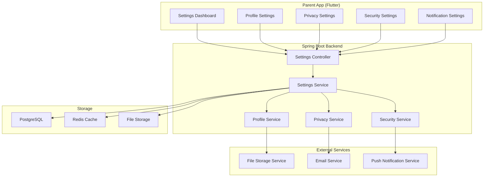
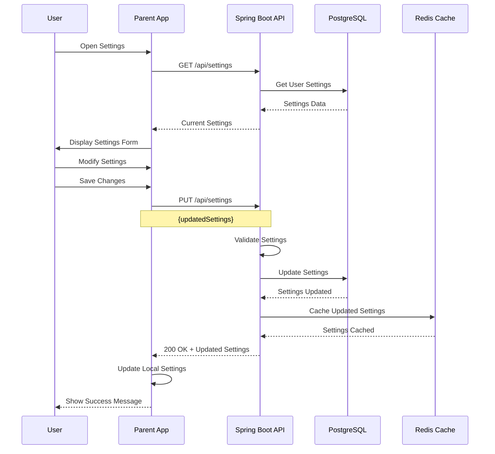
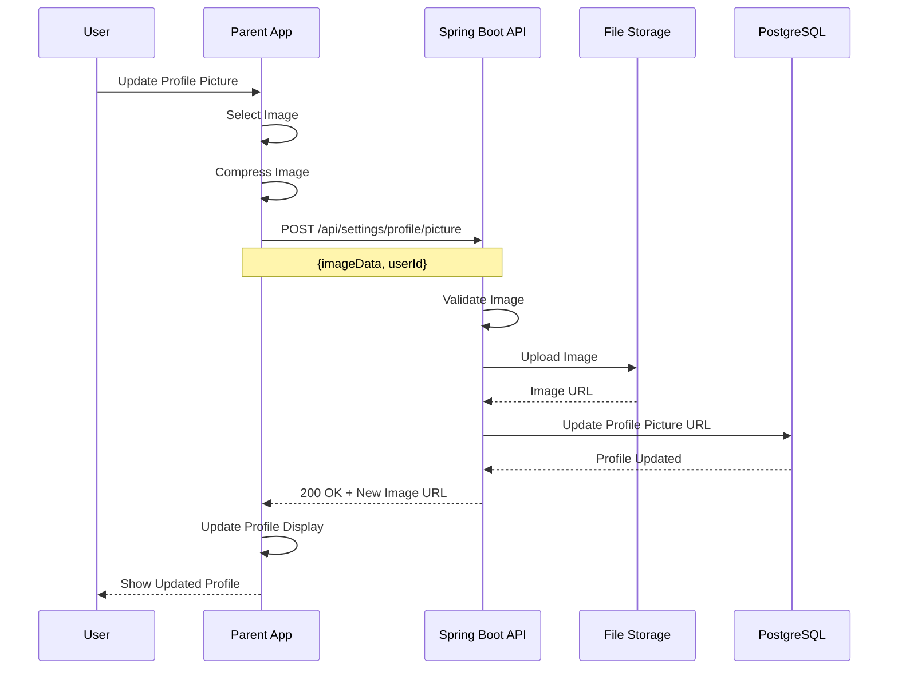
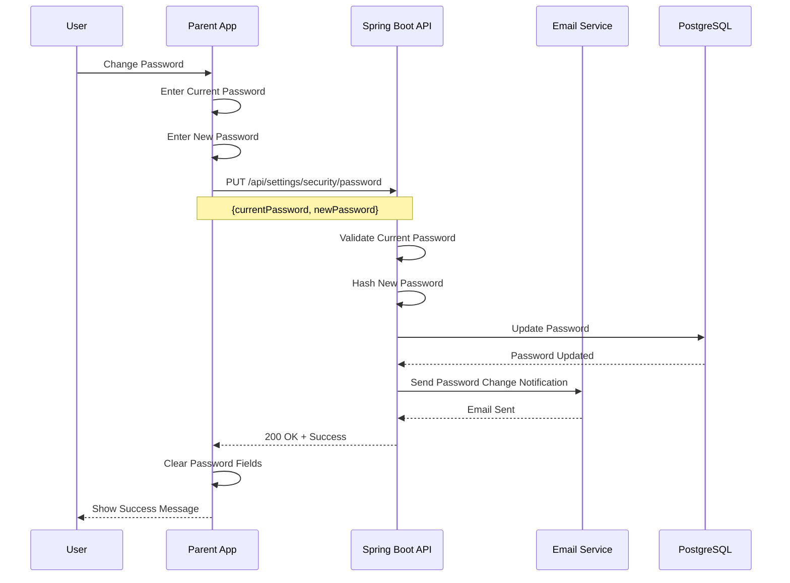

# Feature 08: Settings & Configuration

## Overview
This feature provides comprehensive settings and configuration management for the SafeGuard Parent App. It handles user preferences, app settings, privacy controls, security settings, and system configuration options.

## Table of Contents
1. [Feature Requirements](#feature-requirements)
2. [System Architecture](#system-architecture)
3. [Sequence Diagrams](#sequence-diagrams)
4. [API Specifications](#api-specifications)
5. [Database Design](#database-design)
6. [Frontend Implementation](#frontend-implementation)
7. [Backend Implementation](#backend-implementation)

---

## Feature Requirements

### Functional Requirements
- **FR-01**: Users can manage their profile information and preferences
- **FR-02**: Users can configure app-wide settings and preferences
- **FR-03**: Users can manage privacy and security settings
- **FR-04**: Users can configure notification preferences
- **FR-05**: Users can manage data and storage settings
- **FR-06**: Users can configure location and tracking settings
- **FR-07**: Users can manage account security and authentication
- **FR-08**: Users can export and backup their data
- **FR-09**: Users can manage app permissions and access controls
- **FR-10**: Users can configure system and performance settings

### Non-Functional Requirements
- **NFR-01**: Settings changes applied immediately
- **NFR-02**: Settings data synchronized across devices
- **NFR-03**: Settings changes logged for audit purposes
- **NFR-04**: Settings data encrypted and secured
- **NFR-05**: System supports settings backup and restore
- **NFR-06**: Settings validation and error handling

---

## System Architecture

### Component Diagram


---

## Sequence Diagrams

### Settings Update Flow


### Profile Update Flow


### Security Settings Flow


---

## API Specifications

### Endpoints Table
| Method | Endpoint | Description | Request Body | Response | Status Codes | Auth Required |
|--------|----------|-------------|--------------|----------|--------------|---------------|
| GET | `/api/settings` | Get user settings | None | `SettingsResponse` | 200, 401 | Yes |
| PUT | `/api/settings` | Update user settings | `SettingsRequest` | `MessageResponse` | 200, 400, 401 | Yes |
| GET | `/api/settings/profile` | Get profile settings | None | `ProfileResponse` | 200, 401 | Yes |
| PUT | `/api/settings/profile` | Update profile settings | `ProfileRequest` | `MessageResponse` | 200, 400, 401 | Yes |
| POST | `/api/settings/profile/picture` | Upload profile picture | `MultipartFile` | `ProfilePictureResponse` | 200, 400, 401 | Yes |
| GET | `/api/settings/privacy` | Get privacy settings | None | `PrivacyResponse` | 200, 401 | Yes |
| PUT | `/api/settings/privacy` | Update privacy settings | `PrivacyRequest` | `MessageResponse` | 200, 400, 401 | Yes |
| GET | `/api/settings/security` | Get security settings | None | `SecurityResponse` | 200, 401 | Yes |
| PUT | `/api/settings/security/password` | Change password | `PasswordChangeRequest` | `MessageResponse` | 200, 400, 401 | Yes |
| PUT | `/api/settings/security/2fa` | Enable/disable 2FA | `TwoFactorRequest` | `MessageResponse` | 200, 400, 401 | Yes |
| GET | `/api/settings/export` | Export user data | None | `DataExportResponse` | 200, 401 | Yes |
| DELETE | `/api/settings/account` | Delete account | `AccountDeletionRequest` | `MessageResponse` | 200, 400, 401 | Yes |

### Request/Response Models

#### SettingsRequest
```json
{
  "appSettings": {
    "theme": "LIGHT | DARK | SYSTEM",
    "language": "string",
    "timezone": "string",
    "dateFormat": "string",
    "timeFormat": "12H | 24H",
    "autoSync": "boolean",
    "syncFrequency": "number"
  },
  "notificationSettings": {
    "pushEnabled": "boolean",
    "emailEnabled": "boolean",
    "smsEnabled": "boolean",
    "quietHours": {
      "enabled": "boolean",
      "startTime": "string",
      "endTime": "string",
      "daysOfWeek": ["string"]
    }
  },
  "locationSettings": {
    "trackingEnabled": "boolean",
    "accuracyLevel": "LOW | MEDIUM | HIGH",
    "updateFrequency": "number",
    "backgroundTracking": "boolean"
  },
  "privacySettings": {
    "dataSharing": "boolean",
    "analyticsEnabled": "boolean",
    "crashReporting": "boolean",
    "adPersonalization": "boolean"
  }
}
```

#### ProfileRequest
```json
{
  "firstName": "string",
  "lastName": "string",
  "email": "string",
  "phone": "string",
  "dateOfBirth": "date",
  "gender": "MALE | FEMALE | OTHER",
  "address": {
    "street": "string",
    "city": "string",
    "state": "string",
    "country": "string",
    "postalCode": "string"
  },
  "emergencyContacts": [
    {
      "name": "string",
      "phone": "string",
      "relationship": "string"
    }
  ]
}
```

#### SecurityResponse
```json
{
  "twoFactorEnabled": "boolean",
  "twoFactorMethod": "SMS | EMAIL | AUTHENTICATOR",
  "lastPasswordChange": "datetime",
  "loginHistory": [
    {
      "timestamp": "datetime",
      "ipAddress": "string",
      "device": "string",
      "location": "string"
    }
  ],
  "activeSessions": [
    {
      "sessionId": "string",
      "device": "string",
      "ipAddress": "string",
      "lastActive": "datetime"
    }
  ],
  "securityQuestions": [
    {
      "question": "string",
      "isSet": "boolean"
    }
  ]
}
```

---

## Database Design

### User Settings Table
```sql
CREATE TABLE user_settings (
    id BIGSERIAL PRIMARY KEY,
    user_id BIGINT NOT NULL REFERENCES users(id) ON DELETE CASCADE,
    theme VARCHAR(10) NOT NULL DEFAULT 'SYSTEM',
    language VARCHAR(10) NOT NULL DEFAULT 'en',
    timezone VARCHAR(50) NOT NULL DEFAULT 'UTC',
    date_format VARCHAR(20) NOT NULL DEFAULT 'MM/DD/YYYY',
    time_format VARCHAR(5) NOT NULL DEFAULT '12H',
    auto_sync BOOLEAN NOT NULL DEFAULT true,
    sync_frequency INTEGER NOT NULL DEFAULT 300,
    push_enabled BOOLEAN NOT NULL DEFAULT true,
    email_enabled BOOLEAN NOT NULL DEFAULT true,
    sms_enabled BOOLEAN NOT NULL DEFAULT false,
    quiet_hours_enabled BOOLEAN NOT NULL DEFAULT false,
    quiet_hours_start TIME,
    quiet_hours_end TIME,
    quiet_hours_days JSONB,
    tracking_enabled BOOLEAN NOT NULL DEFAULT true,
    accuracy_level VARCHAR(10) NOT NULL DEFAULT 'MEDIUM',
    update_frequency INTEGER NOT NULL DEFAULT 30,
    background_tracking BOOLEAN NOT NULL DEFAULT true,
    data_sharing BOOLEAN NOT NULL DEFAULT false,
    analytics_enabled BOOLEAN NOT NULL DEFAULT true,
    crash_reporting BOOLEAN NOT NULL DEFAULT true,
    ad_personalization BOOLEAN NOT NULL DEFAULT false,
    created_at TIMESTAMP NOT NULL DEFAULT CURRENT_TIMESTAMP,
    updated_at TIMESTAMP NOT NULL DEFAULT CURRENT_TIMESTAMP
);

CREATE UNIQUE INDEX idx_user_settings_user_id ON user_settings(user_id);
```

### User Profiles Table
```sql
CREATE TABLE user_profiles (
    id BIGSERIAL PRIMARY KEY,
    user_id BIGINT NOT NULL REFERENCES users(id) ON DELETE CASCADE,
    first_name VARCHAR(100),
    last_name VARCHAR(100),
    profile_picture_url VARCHAR(500),
    date_of_birth DATE,
    gender VARCHAR(10) CHECK (gender IN ('MALE', 'FEMALE', 'OTHER')),
    address_street VARCHAR(255),
    address_city VARCHAR(100),
    address_state VARCHAR(100),
    address_country VARCHAR(100),
    address_postal_code VARCHAR(20),
    bio TEXT,
    created_at TIMESTAMP NOT NULL DEFAULT CURRENT_TIMESTAMP,
    updated_at TIMESTAMP NOT NULL DEFAULT CURRENT_TIMESTAMP
);

CREATE UNIQUE INDEX idx_user_profiles_user_id ON user_profiles(user_id);
```

### Security Settings Table
```sql
CREATE TABLE security_settings (
    id BIGSERIAL PRIMARY KEY,
    user_id BIGINT NOT NULL REFERENCES users(id) ON DELETE CASCADE,
    two_factor_enabled BOOLEAN NOT NULL DEFAULT false,
    two_factor_method VARCHAR(20),
    two_factor_secret VARCHAR(255),
    last_password_change TIMESTAMP,
    password_reset_token VARCHAR(255),
    password_reset_expires TIMESTAMP,
    failed_login_attempts INTEGER NOT NULL DEFAULT 0,
    account_locked_until TIMESTAMP,
    created_at TIMESTAMP NOT NULL DEFAULT CURRENT_TIMESTAMP,
    updated_at TIMESTAMP NOT NULL DEFAULT CURRENT_TIMESTAMP
);

CREATE UNIQUE INDEX idx_security_settings_user_id ON security_settings(user_id);
```

### Login History Table
```sql
CREATE TABLE login_history (
    id BIGSERIAL PRIMARY KEY,
    user_id BIGINT NOT NULL REFERENCES users(id) ON DELETE CASCADE,
    login_timestamp TIMESTAMP NOT NULL,
    ip_address VARCHAR(45) NOT NULL,
    user_agent TEXT,
    device_type VARCHAR(20),
    location VARCHAR(100),
    success BOOLEAN NOT NULL DEFAULT true,
    failure_reason VARCHAR(100),
    created_at TIMESTAMP NOT NULL DEFAULT CURRENT_TIMESTAMP
);

CREATE INDEX idx_login_history_user_id ON login_history(user_id);
CREATE INDEX idx_login_history_timestamp ON login_history(login_timestamp);
CREATE INDEX idx_login_history_ip ON login_history(ip_address);
```

### Emergency Contacts Table
```sql
CREATE TABLE emergency_contacts (
    id BIGSERIAL PRIMARY KEY,
    user_id BIGINT NOT NULL REFERENCES users(id) ON DELETE CASCADE,
    name VARCHAR(100) NOT NULL,
    phone VARCHAR(20) NOT NULL,
    email VARCHAR(255),
    relationship VARCHAR(50) NOT NULL,
    is_primary BOOLEAN NOT NULL DEFAULT false,
    created_at TIMESTAMP NOT NULL DEFAULT CURRENT_TIMESTAMP
);

CREATE INDEX idx_emergency_contacts_user_id ON emergency_contacts(user_id);
```

---

## Frontend Implementation (Flutter)

### Project Structure
```
lib/features/settings/
├── data/
│   ├── datasources/
│   │   ├── settings_local_datasource.dart
│   │   └── settings_remote_datasource.dart
│   ├── models/
│   │   ├── settings_model.dart
│   │   ├── profile_model.dart
│   │   └── security_model.dart
│   └── repositories/
│       └── settings_repository_impl.dart
├── domain/
│   ├── entities/
│   │   ├── settings.dart
│   │   ├── profile.dart
│   │   └── security.dart
│   ├── repositories/
│   │   └── settings_repository.dart
│   └── usecases/
│       ├── update_settings_usecase.dart
│       ├── update_profile_usecase.dart
│       └── change_password_usecase.dart
└── presentation/
    ├── pages/
    │   ├── settings_page.dart
    │   ├── profile_settings_page.dart
    │   ├── privacy_settings_page.dart
    │   ├── security_settings_page.dart
    │   └── data_export_page.dart
    ├── widgets/
    │   ├── settings_section.dart
    │   ├── settings_tile.dart
    │   └── profile_picture_widget.dart
    └── providers/
        └── settings_provider.dart
```

### Key Dependencies
```yaml
dependencies:
  # State management
  flutter_riverpod: ^2.4.0
  
  # UI components
  flutter_form_builder: ^9.1.1
  form_builder_validators: ^9.1.0
  
  # Image handling
  image_picker: ^1.0.4
  cached_network_image: ^3.3.0
  
  # HTTP client
  dio: ^5.3.2
  
  # Local storage
  shared_preferences: ^2.2.2
  
  # File handling
  path_provider: ^2.1.1
```
---

## Security Considerations

### Settings Security
- **Data Encryption**: Settings data encrypted in transit and at rest
- **Access Control**: Users can only access their own settings
- **Audit Logging**: Track all settings changes
- **Validation**: All settings validated before saving

### Privacy Compliance
- **Data Minimization**: Only necessary settings collected
- **Consent Management**: Clear consent for data collection
- **Right to Delete**: Users can delete their settings
- **Transparency**: Clear information about settings usage

---

## Testing Strategy

### Unit Tests
- **Service Layer**: Test settings management business logic
- **Validation**: Test settings validation and constraints
- **Security**: Test security settings functionality

### Integration Tests
- **API Endpoints**: Test settings CRUD operations
- **File Upload**: Test profile picture upload
- **Data Export**: Test data export functionality

### Performance Tests
- **Settings Load**: Test settings loading performance
- **File Upload**: Test profile picture upload performance
- **Data Export**: Test large data export performance

This comprehensive feature documentation provides everything needed to implement the Settings & Configuration feature for the SafeGuard Parent App.
